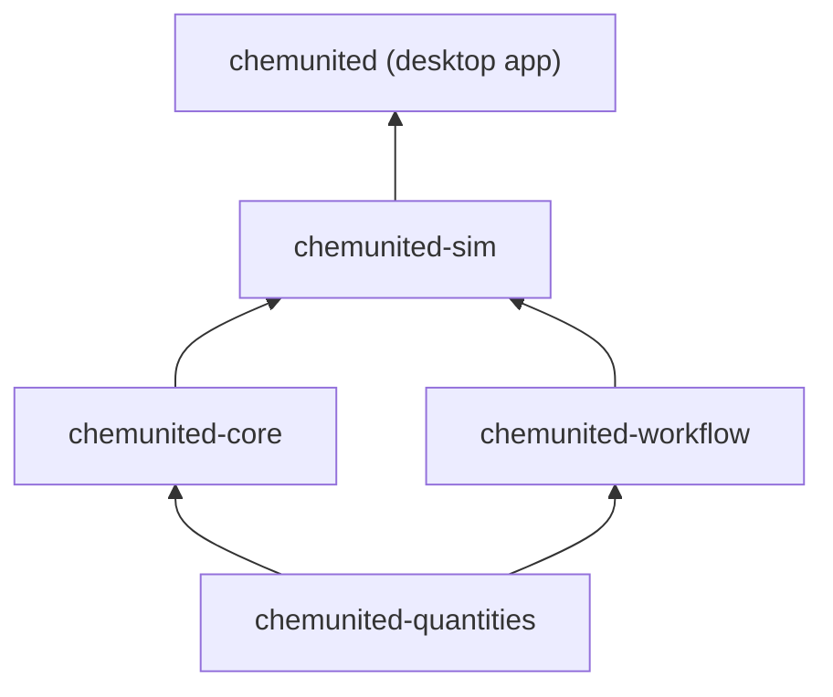

<p align="center">
  
</p>

# ChemUnited

[](https://github.com/automatedchemistry/chemunited-orchestrator/actions/workflows/pre-commit.yml)
[](https://github.com/automatedchemistry/chemunited-orchestrator/actions/workflows/security.yml)
[](LICENSE)

A platform for designing, simulating, and executing chemical process workflows on real automated laboratory hardware. Built at the Max Planck Institute of Colloids and Interfaces for real lab automation, not a demo — every package here backs actual hardware-in-the-loop experiments.

## Install

Download `windows_installer.bat` from the [latest release](https://github.com/automatedchemistry/chemunited-orchestrator/releases/latest) and double-click it.

- **Windows only** (the desktop app is a PyQt5 GUI)
- Installs Python and ChemUnited into your own user folder — **no admin rights needed**
- Adds a "ChemUnited" shortcut to your Desktop
- Re-running it later upgrades to the latest release

## Documentation

Full user guide: **[chemunited-docs.readthedocs.io](https://chemunited-docs.readthedocs.io/en/latest/)**

## License

MIT — see [LICENSE](LICENSE). © Automated Chemistry, Max Planck Institute of Colloids and Interfaces.

---

## For developers

This repository is a [uv workspace](https://docs.astral.sh/uv/concepts/projects/workspaces/) holding five independently-versioned, independently-published Python packages plus the Windows desktop app above. All five are pre-1.0 (`0.0.x`) and under active development.

### Packages & how they relate



| Layer | Package directory | Install name | Depends on | What it does |
|---|---|---|---|---|
| 1 | [`packages/chemunited-quantities/`](packages/chemunited-quantities) | `chemunited-quantities` | — | Lab-aware physical quantity primitive (wraps [pint](https://pint.readthedocs.io/) with a chemistry-domain unit registry) |
| 2 | [`packages/chemunited-core/`](packages/chemunited-core) | `chemunited-core` | quantities | Core data models for orchestration, execution, and simulation of protocols |
| 2 | [`packages/chemunited-workflow/`](packages/chemunited-workflow) | `chemunited-workflow` | quantities | Conditional NetworkX-based workflow execution with loopbacks and parallel branches |
| 3 | [`packages/chemunited-sim/`](packages/chemunited-sim) | `chemunited-sim` | core, workflow | Dynamic simulation engine for fluidic automation platforms |
| 4 | [`packages/chemunited-orchestrator/`](packages/chemunited-orchestrator) | **`chemunited`** | core, workflow, sim | Desktop app for designing, simulating, and executing workflows on real hardware |

> `packages/chemunited-orchestrator/` installs as `pip install chemunited` — not `chemunited-orchestrator`. The directory is named after the repo; the PyPI package is named after the app.

These were five separate repositories until they were consolidated into one uv workspace, specifically so a cross-cutting change (e.g. a `chemunited-core` schema change consumed by `chemunited-sim`) can be developed, linted, type-checked, and reviewed as one pull request instead of five.

### Dev setup

```bash
git clone https://github.com/automatedchemistry/chemunited-orchestrator.git
cd chemunited-orchestrator
uv sync --all-extras
uv run pre-commit install
```

This installs all five packages editable into one shared `.venv`, resolving them against each other locally instead of PyPI. See each package's own README (linked in the table above) for package-specific dev/test commands.

Just want one package as a library elsewhere?

```bash
pip install chemunited-core
```

(swap in `chemunited-quantities`, `chemunited-workflow`, or `chemunited-sim` as needed)

### Repository layout

```
chemunited-orchestrator/
├── packages/                 five workspace packages (see table above)
├── .github/workflows/        shared pre-commit + security CI, one publish workflow per package
├── windows_installer.bat     one-file Windows installer for the desktop app
├── example/                  sample .chemunited project files
└── pyproject.toml            uv workspace root config
```

### Releases

Each package versions and publishes to PyPI independently, triggered by pushing a `<package>-vX.Y.Z` tag (e.g. `chemunited-core-v0.0.7`).
