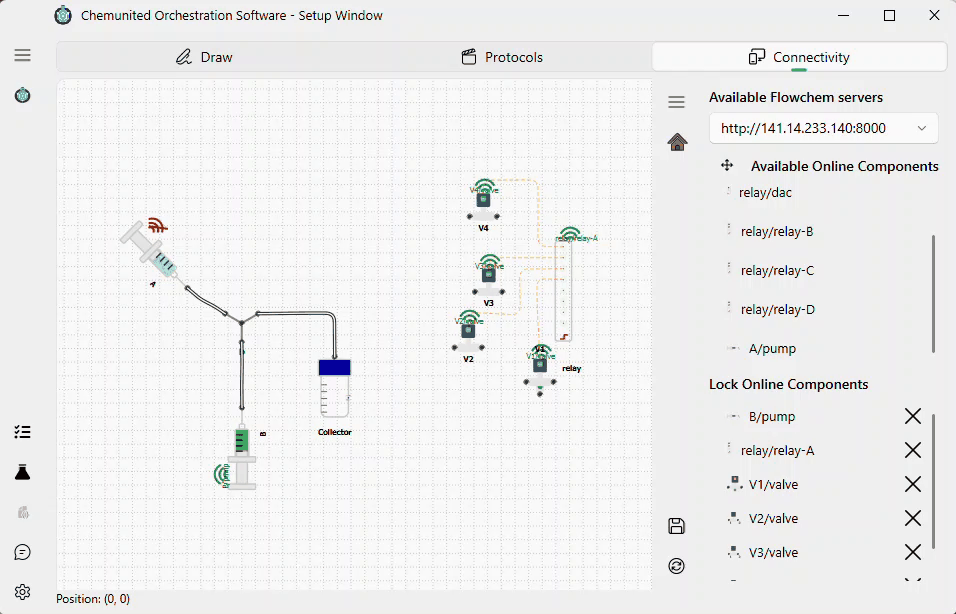

# Setup Connectivity

Device connectivity and access to hardware capabilities are provided through the FlowChem package.
FlowChem exposes connected components (pumps, valves, sensors, etc.) through a server, which can be accessed via API requests. This approach:

* improves interoperability (devices can be controlled in a consistent way),

* keeps the orchestration software decoupled from hardware-specific implementations,

* reduces direct dependencies between the workflow execution and the device drivers.

For more information, see the [FlowChem documentation](https://flowchem.readthedocs.io/en/latest/).

<div class="info-block">
<strong>💡 Note</strong><br>
ChemUnited does not launch or configure the FlowChem server for you, run it yourself using
FlowChem's own tooling, following the FlowChem documentation above. The Orchestrator's
Connectivity panel only discovers and associates devices from a server that is already running.
</div>

FlowChem itself ships a companion desktop app,
[flowchem-qt](https://flowchem.readthedocs.io/en/latest/user-guides/tools.html#flowchem-qt)
(`pip install flowchem-qt`, then run `flowchem-qt`) used to: editing the server's `config.toml`, starting/stopping the server,
autodiscovering devices, and viewing live server logs. All from one window, optionally minimized
to the system tray.

## Other protocols: SiLA2 and OPC UA

FlowChem/HTTP is not the only device protocol the platform can talk to. The underlying execution
engine (`chemunited-workflow`) can also drive devices directly over **SiLA2** and **OPC UA**.

Unlike FlowChem, there is no discovery or drag-and-drop UI for these two protocols in this version. An association for a SiLA2 or OPC UA device must be hand-written directly into the project's
`associations.json` file. See [Associations file](#associations-file) below for the exact fields
each protocol needs.

## Execution model: everything is synchronous to you

Regardless of which protocol backs a device, every call you make to it — from a Command block or
from a script (`self.platform["device"].get(...)` / `.put(...)`) is a plain, blocking call that
only returns once the device has responded.

<div class="info-block">
<strong>💡 Information</strong><br>
This holds even for protocols that are natively asynchronous under the hood: SiLA2 communicates
over gRPC and OPC UA is built on <code>asyncua</code>, which runs its own background event loop. Both are wrapped in a synchronous facade by the platform, so writing a protocol against a SiLA2 or
OPC UA device looks exactly the same as writing one against a FlowChem device.
</div>

## Associate components

In the **Connectivity** panel (shown below), the list of online components is populated based on the selected 
**FlowChem server address**.

<div class="warning-block">
<strong>⚠️ Warning</strong><br>
This drag-and-drop identification/association flow only works for <strong>FlowChem</strong>
servers in this version. SiLA2 and OPC UA devices are not discovered here. Associate them by
hand-editing <code>associations.json</code> instead (see below).
</div>

To associate a device with the workflow graph:

1. Select a component from the online components list.

2. Drag and drop it onto the corresponding component representation in the graph.

3. When the online component matches the abstract component type, the graph displays a **connected indicator**.



After this step, the abstract component in the workflow graph is linked to the real device exposed by the 
FlowChem server, and the process can control it during execution.

## Associations file

Every project stores its device connectivity as `connectivity/associations.json`. Understanding
its shape is only necessary if you need a SiLA2 or OPC UA device. FlowChem entries are managed
entirely by the drag-and-drop flow above and rewritten automatically every time you save the
project, so you should not hand-edit those. The file has a list of `associations`:

```json
{
  "associations": [
    { "component": "pump_01", "component_url": "http://192.168.1.10/devices/pump_01" },
    {
      "component": "sila_pump",
      "protocol": "sila2",
      "sila_host": "192.168.1.50",
      "sila_port": 50052,
      "sila_insecure": true
    },
    {
      "component": "opc_reactor",
      "protocol": "opcua",
      "opcua_endpoint": "opc.tcp://192.168.1.60:4840",
      "opcua_node_id": "ns=2;s=Reactor1",
      "opcua_idle_path": "2:Diagnostics/2:IsBusy",
      "opcua_idle_value": false
    }
  ]
}
```

Every entry needs `component` (must match the name of the abstract component on your platform) and
an optional `protocol` (`"flowchem"` (the default), `"sila2"`, or `"opcua"`) plus the fields that
protocol needs:

| Protocol | Fields |
|---|---|
| `flowchem` (default) | `component_url` — relative to the top-level `server_url` if that key is present, otherwise a full absolute URL. |
| `sila2` | `sila_host`, `sila_port`, `sila_insecure` (defaults to `true`). |
| `opcua` | `opcua_endpoint`, `opcua_node_id`, and optionally `opcua_username`, `opcua_password`, `opcua_idle_path`, `opcua_idle_value` (defaults to `false`). |

An entry missing its protocol's required fields is silently skipped (useful for a device that
exists physically but isn't wired up yet); an unrecognized `protocol` value raises an error when
the project loads.

<div class="info-block">
<strong>💡 Information</strong><br>
Hand-written SiLA2/OPC UA entries are safe to keep in the same file as the drag-and-drop FlowChem
ones. The Orchestrator preserves any entry it doesn't manage exactly as written, even for
components that aren't currently on the canvas, so saving the project from the GUI will never
overwrite or drop them.
</div>
