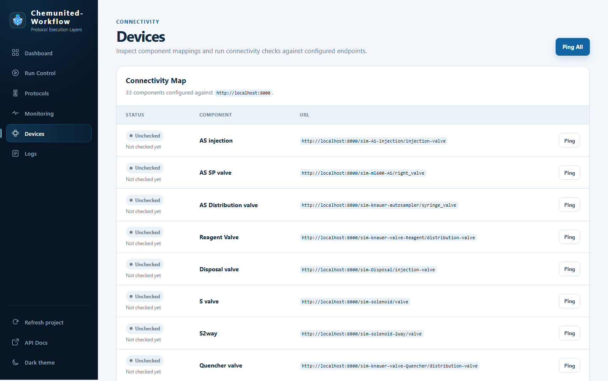

# Devices

**Devices** shows the connectivity map of every component associated in
[Connect Devices](../connectivity/connectivity.md), with a reachability check for each one — confirming devices
are online before starting a run, without needing the desktop orchestrator open.

## Connectivity Map

The card header shows how many components are configured and the base device-server URL they're checked against
(e.g. `33 components configured against http://localhost:8000`). The table below lists, per component:

* **Status** — `Unchecked` until pinged, then `online`/`offline` (with latency, when online) or `unmapped` if the
  component has no endpoint configured.
* **Component** — the device's custom name, matching the name used in [Connect Devices](../connectivity/connectivity.md)
  and referenced in generated protocol code (e.g. `self.platform["pt100"]`).
* **URL** — the full endpoint the dashboard pings for that component.

Click **Ping** on a single row to check just that component, or **Ping All** at the top to check every component
at once.
