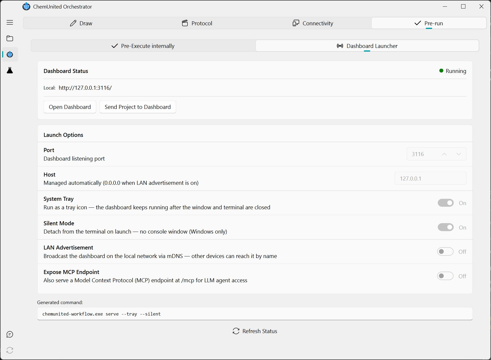
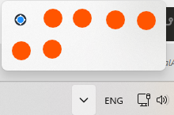

# Dashboard Launcher

The **Dashboard Launcher** is the second tab of the [Pre-Running](../protocols/pre_running.md) frame (next to
**Pre-Execute internally**). It starts and manages the browser-based [Dashboard](overview.md)
work-server directly from the desktop app, so you don't have to run its CLI command by hand.

## Dashboard Status

* **Status badge** — `Running` / `Not Running`, based on whether the configured port already responds.
* **Local** — the local URL the dashboard is served at (`http://127.0.0.1:<port>/`).
* **Open Dashboard** — opens the local URL in your default browser. Only enabled while the dashboard is running.
* **Send Project to Dashboard** — pushes the currently open project's folder to the running server, so the
  dashboard starts serving that project without needing a restart. Only shown while the dashboard is running, and
  requires a project to already be open in the orchestrator.

## Launch Options

| Option | Description |
|---|---|
| **Port** | The dashboard's listening port (default `3116`). |
| **Host** | Read-only; managed automatically. Stays `127.0.0.1` (local-only) unless **LAN Advertisement** is on, in which case it switches to `0.0.0.0` so other devices can reach it. |
| **System Tray** | Keeps the dashboard running as a tray icon after the launcher window and terminal are closed. Requires the `pystray` package — if it isn't installed, the dashboard launches without tray support and a warning is logged (install with `pip install chemunited-workflow[tray]`). |
| **Silent Mode** | Windows only, and only takes effect when **System Tray** is also on. Detaches the process from the terminal on launch, so no console window appears. |
| **LAN Advertisement** | Broadcasts the dashboard on the local network via mDNS, so other devices can reach it by name instead of by IP. Turning it on reveals a **Network Name** field (defaults to `ChemUnited @ <hostname>`) used as the advertised name. |
| **Expose MCP Endpoint** | Also serves a Model Context Protocol (MCP) endpoint at `/mcp`, for LLM agents to interact with the project (see [API & MCP Tools](api_and_mcp.md)). Turning it on reveals the **MCP Client Configuration** card below. |

<strong>💡 Information</strong> 
The <strong>Generated command</strong> box below the options always shows the exact
<code>chemunited-workflow serve ...</code> command your current selection maps to — useful if you'd rather copy it
and run the dashboard from a terminal instead of launching it from the GUI.

With **System Tray** on, the dashboard keeps running in the background as an icon in the Windows system tray (the
overflow area next to the clock) after the launcher window and terminal are closed. Right-click it for **Open
App** (opens the dashboard in your browser), **Status**, and **Quit**:

## Launching and stopping

Click **Launch Dashboard** to start the server with the options above. If a dashboard is already running on the
configured port, the launcher warns instead of starting a second instance. Once running, the Launch Options card
is disabled (options can't be changed on a running server) and the button row switches to **Open Dashboard** /
**Send Project to Dashboard**.

Use **Refresh Status** at any time to re-check whether the configured port is currently occupied — for example,
after starting or stopping the dashboard from a terminal outside the launcher.

## MCP Client Configuration

When **Expose MCP Endpoint** is on, a card appears with a ready-to-use JSON snippet for MCP clients (e.g.
`claude_desktop_config.json`), pointing at this dashboard's `/mcp` endpoint. Click **Copy Config** to copy it to
the clipboard.