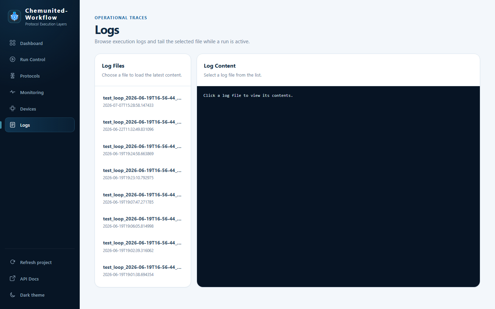

# Logs

**Logs** browses and tails the work-server's log files — useful for diagnosing a run without needing terminal or
file access to the machine the server is running on.

## Log Files

The left card lists every log file the project has produced, newest first, named after the process and run that
produced them (e.g. `test_loop_2026-06-19T16-56-44_...`) with their last-modified timestamp underneath.

## Log Content

Click a file in the list to load its contents into the right-hand viewer. While a run is active, the log for that
run tails automatically as new lines are written, so you can watch execution progress without leaving the page.
