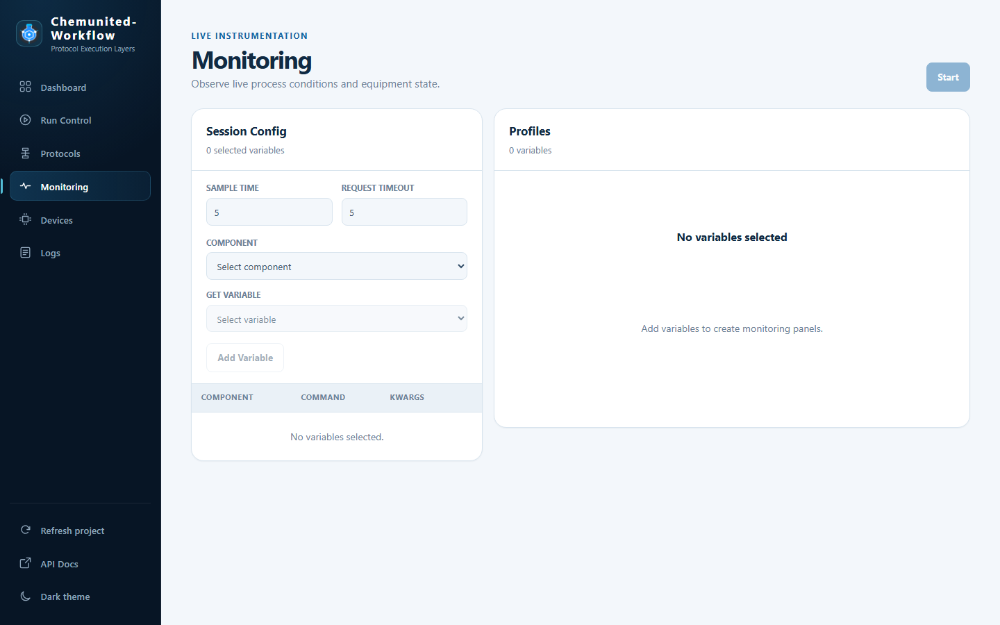

# Monitoring

<strong>⚠️ Not the same as the Monitor window</strong> 
This page polls arbitrary device variables on demand, independent of any run. It is a different feature from the
desktop orchestrator's <a href="../monitoring/run_monitoring.md">Monitor window</a>, which watches a protocol
<em>while it executes</em>. Use this page to observe equipment state at any time; use
<a href="run_control.md">Run Control</a> and the Monitor window to watch an actual run.

**Monitoring** lets you poll live values from any connected device — useful for watching equipment state before,
between, or independently of runs (e.g. keeping an eye on a temperature reading while you set up a platform by
hand).

## Session Config

| Field | Description |
|---|---|
| **Sample Time** | How often (in seconds) each variable is polled. |
| **Request Timeout** | How long to wait for a device to respond before treating that poll as failed. |
| **Component** | The device to read from. |
| **Get Variable** | Which of that device's `GET` commands to poll. |

Click **Add Variable** to add the selected component/command pair to the polling table below the form (shown with
its **Component**, **Command**, and **Kwargs**). Click **Start** at the top to begin polling every variable in the
table at the configured sample time.

## Profiles

The right card shows a live panel per polled variable once a session is running, plotting readings as they come
in. With no variables added yet, it shows **No variables selected**.
