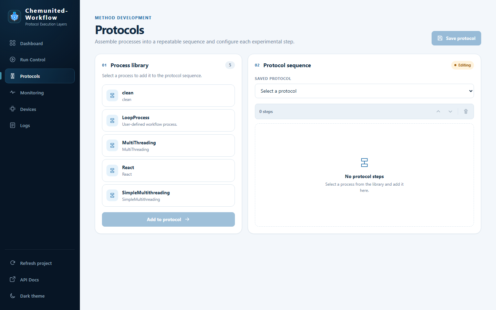

# Protocols

**Protocols** assembles the project's processes into a saved, repeatable sequence — the same protocol files listed
as cards in the desktop orchestrator's [Pre-Running](../protocols/pre_running.md) frame, and the same ones selected
in [Run Control](run_control.md).

## Process library

The left card lists every process registered in the project (built in
[Build Protocols](../protocols/build_protocols.md)), with a count badge showing how many are available. Select one
and click **Add to protocol** to append it to the sequence you're building.

## Protocol sequence

The right card is the sequence itself:

* **Saved Protocol** — a dropdown to load an existing saved protocol file for editing instead of starting from
  scratch.
* The step list shows each process you've added, in execution order, with controls to reorder (up/down) or delete
  a step. An empty sequence shows **No protocol steps** until you add one from the library.
* The status badge (e.g. `Editing`) reflects whether the currently loaded sequence has unsaved changes.

Click **Save protocol** to write the sequence out as a new, timestamped protocol file — saved protocols are
immutable, so saving again creates a new file rather than overwriting the one you loaded.

<strong>💡 Information</strong> 
Deleting a saved protocol file is only available in builder mode from the API/MCP surface — see
<a href="api_and_mcp.md">API & MCP Tools</a>.

