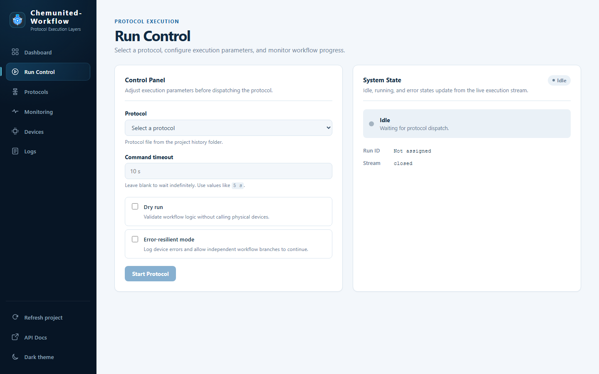

# Run Control

**Run Control** starts and cancels runs, and shows their progress live as they execute.

## Control Panel

| Field | Description |
|---|---|
| **Protocol** | Which saved [protocol](protocols.md) file to run — pulled from the project's protocol history folder. |
| **Command timeout** | Maximum time to wait for a single device command before it's considered failed (e.g. `10 s`). Leave blank to wait indefinitely. |
| **Dry run** | Validates the workflow's logic without actually calling physical devices — useful for checking a protocol is wired correctly before running it for real. |
| **Error-resilient mode** | Logs device errors but lets independent workflow branches keep running instead of stopping the whole run on the first failure. |

Click **Start Protocol** to dispatch the run. If a run is already active, starting another is rejected until the
current one finishes or is cancelled.

## System State

The right-hand card reflects the run's state live, streamed over Server-Sent Events rather than requiring a manual
refresh:

* **Status badge** — `Idle`, `Running`, or an error state.
* **Run ID** — the identifier of the active run, once one is dispatched.
* **Stream** — whether the live event connection is `open` or `closed`.

<strong>💡 Information</strong> 
This is the browser equivalent of clicking <strong>Start protocol</strong> / <strong>Stop protocol</strong> in the
desktop orchestrator's <a href="../monitoring/run_monitoring.md">Monitor window</a> — but reachable from any
machine with access to the dashboard, not just the machine running the orchestrator.

