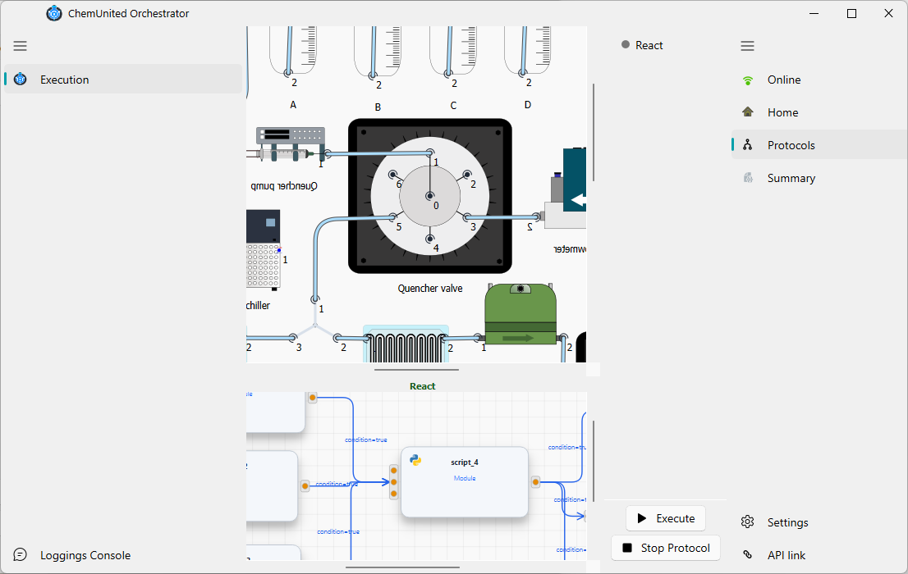

# Run and Monitoring

The Execution window is intentionally simpler than the Setup window. Its purpose is to **run a protocol that has
already been created**, following the order of the processes listed under **Active Processes**
(configured in [Pre-Running](../protocols/pre_running.md)).

The sidebar on the right side of the window has the following items:

| Item | Description |
|---|---|
| **Online / Offline** | Connects to (or disconnects from) the execution API. Must be **Online** before a protocol can run. |
|  **Home** | Recenters both the platform diagram and the workflow graph shown in the main canvas. |
| **Protocols** | The page shown by default — lists **Active Processes** and holds the **Execute** / **Stop Protocol** buttons described below. |
|  **Summary** | Opens a read-only window with **Parameters** and **Report** tabs — all predefined parameters (main and process) with their current values, and a report of the run. |

At the bottom of that sidebar:

| Action | Description |
|---|---|
| **Settings** | Opens the **Run Configuration** dialog — the protocol to run (read-only here) plus **command timeout**, **dry run**, and **error-resilient mode**. These are the same options exposed by the browser dashboard's [Run Control](../dashboard/run_control.md) page. |
| **API link** | Opens the execution API's URL in your browser. |

On the **Protocols** page itself:

*  **Execute** — starts the protocol, running every process listed in **Active Processes** in order. Disabled while a protocol is already running.
*  **Stop Protocol** — stops the currently running protocol execution.

<strong>💡 Information</strong> 
If you click <strong>Execute</strong> while a run is already active elsewhere, the window asks whether to stop the
conflicting run first — <strong>Active Processes</strong> itself does not offer a way to run a single process on
its own.

## Next steps

The Execution window above is the desktop-side view of a run. Once a protocol starts, execution is actually
handed off to a separate execution engine (the "work-server") that also exposes a browser dashboard and a
remote/automation API — see [The Dashboard](../dashboard/overview.md) to control or inspect a run from a browser
or another machine.

Ready to try it? See [Run a Protocol](../tutorials/monitoring_tutorial.md) for a step-by-step walkthrough.