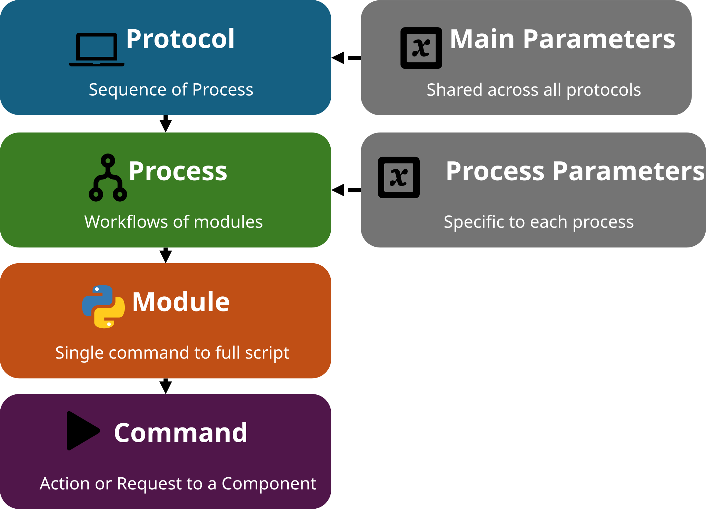
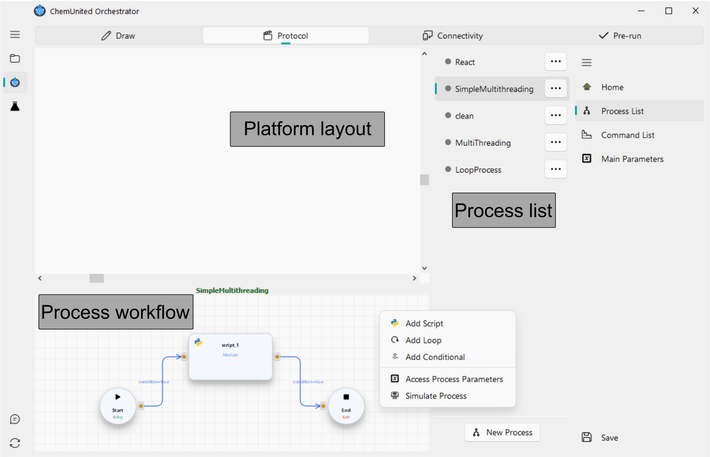
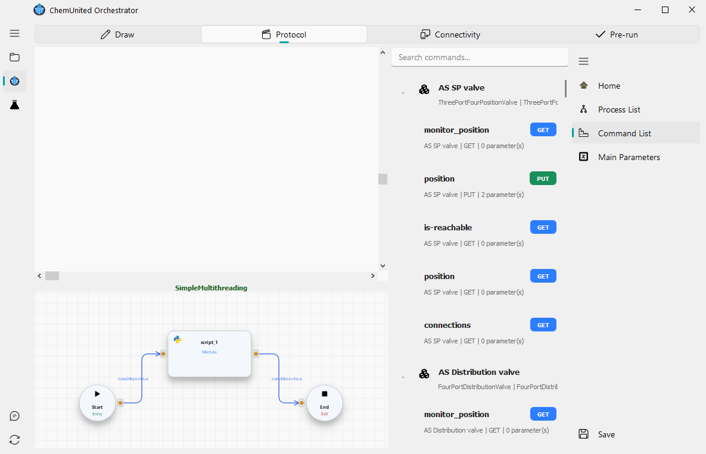

# Build Protocols

The objective of this frame is to create and organize the protocols that define how the platform operates.

Before explaining how the orchestration system is designed to build these protocols, it is important to understand 
how the protocol structure is organized within the package.

## Protocol Hierarchy

The following diagram illustrates the hierarchical relationship between the different elements that make up a protocol:

<strong>💡 Information</strong>  
This hierarchical organization allows the orchestration to combine automation logic with flexible scripting. 
Complex experimental protocols can therefore be built by combining processes, modules, and component-level commands. 

## Explanation of Each Level

### Protocol

A protocol is the highest level in the orchestration hierarchy.
It is composed of a series of processes, which are executed sequentially, one after another.

###  Process

Each process contains one workflow composed of modules.
Processes are executed in sequence, but within a process, the modules can run simultaneously through a multithreading workflow.

###  Module

A module is a single step in a process workflow. It can be as small as one command sent directly to a
device (a **Command** module, dragged from the Command List — no code required), or a full **Script** block
containing a sequence of Python commands for more complex logic. **Loop** and **Conditional** modules add
repetition and branching. See [Process workflow](module_workflows.md) for details on each type.

###  Command

A command is the lowest-level instruction in the hierarchy.
It represents a specific request or actuation sent to an electronic component in the system (e.g., start a pump, read a sensor, open a valve).

###  Parameters

The Parameters script defines a set of variables that the user can create and reuse across the entire platform.
This feature is optional, but extremely helpful for complex setups where protocols depend on shared values, user-defined constants, or validation logic.

There are two types of parameters:

* Main Parameters – global variables available to all protocols in the project.
These typically define general configuration values that remain consistent throughout the orchestration.

* Process Parameters – local variables defined within a specific process.
They apply only to that process and allow fine-tuning of parameters without affecting other parts of the platform.

Using parameters promotes modularity and flexibility: the same protocol can be reused with different parameter sets, and complex workflows can automatically validate or adjust values before execution.

## Process Availability

When building protocols, each process can have one of two statuses:

1. **Available**

The process is defined and stored in the protocol, but **not** currently scheduled for execution.

## ChemUnited Protocols Panel

The main protocols panel is shown below.

This frame is divided into three areas:

1. **Platform layout**

The platform drawing is displayed here. Although it does not have any direct functionality for protocol building, it is very useful for 
inspecting the physical setup so the user can write commands correctly.

2. **Process workflow canvas**

Below the platform layout, this area shows the workflow graph of the currently selected process. 
The details of how to build and edit workflows are explained in the [next section](module_workflows.md).

3. **Process list and navigation**

On the right side you will find the **Process List**, with one row per process. Each row has a context menu
(accessed via the **···** button) with the following options:

   - ✏️ **edit**: Rename the item.  
   -  **parameter**: Open the process parameter settings.  
   - 📚 **duplicate**: Create a copy of the item.  
   -  **remove**: Delete the item.

To the right of the Process List, a vertical navigation rail switches between: **Home**, **Process List**,
**Command List** (see below), and **Main Parameters** (opens the main experiment parameter script, described in
[Parameters](parameters.md)).

---

### Command List

The **Command List** shows every command exposed by the devices associated with the platform (see
[Connect Devices](../connectivity/connectivity.md)), so you can build a workflow without writing any code.

Commands are grouped by device — each group header shows the device's custom name and its component type (e.g.
`AS SP valve` — `ThreePortFourPositionValve`). Under each group, every command is listed with:

* its name (e.g. `monitor_position`, `position`, `is-reachable`),
* an HTTP method badge (**GET** or **PUT** — see [Script Editor](script_editor.md) for what each method means),
* and its device name, method, and number of parameters.

Use the **search bar** at the top to filter commands by name or device instead of scrolling through every group.

To use a command, **drag it directly from the Command List onto the workflow canvas** — this creates a command
block for that exact device/command pair, ready to connect into your workflow.

---

### Workflow canvas menu

Double-clicking the workflow canvas opens a context menu with the actions used to build the workflow:

| Icon | Action | Description |
|---|---|---|
|  | **Add Script** | Creates a new Script module/block. |
|  | **Add Loop** | Creates a new Loop module/block. |
|  | **Add Conditional** | Creates a new Conditional module/block. |
|  | **Access Process Parameters** | Opens the parameter settings for the current process. |
|  | **Simulate Process** | Runs this process in simulation mode. |

At the bottom of the frame, two standalone buttons are always available:

*  **New Process** — creates a new process and adds it to the Process List.
*  **Save** — saves the current project protocols.