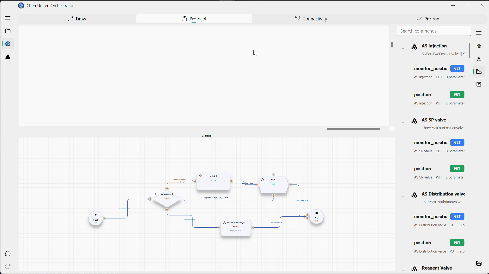
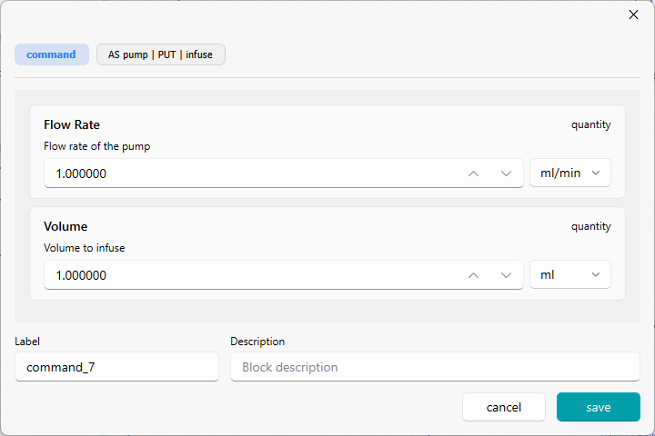
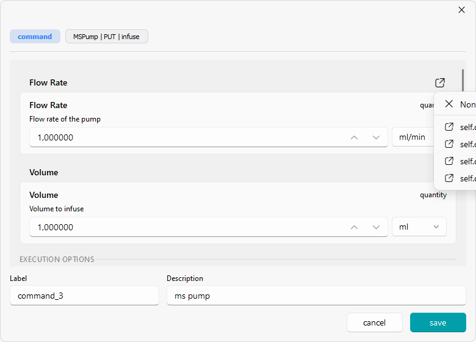

# Command

## What is a Command module

A **Command module** represents a single command sent to one associated device — the lowest-level instruction in
the [protocol hierarchy](build_protocols.md#explanation-of-each-level). It requires no code: rather than writing Python, you pick a
device and one of its exposed commands, and the platform builds the request for you.

It is one of the [four module types](module_workflows.md#module-types) that make up a workflow (alongside Script,
Loop, and Conditional), but it behaves differently from the other three:

* Script, Loop, and Conditional modules are created empty from the canvas menu and then written/configured.
* A Command module is never created empty — it is dragged directly from the
  [Command List](build_protocols.md#command-list) onto the canvas, which creates a block already bound to that
  exact device/command pair.

<div class="info-block"> <strong>
💡 Information</strong><br> The <a href="script_editor.md">Script Editor</a>'s <strong>Add Command</strong> helper
exposes this same underlying concept — device, command, parameters, execution options — but produces a different
result: it inserts an equivalent call into the Python source of a Script module, instead of configuring a
standalone Command block.
</div>

## Building a Command block

Command blocks are built from the **[Command List](build_protocols.md#command-list)**, the panel that lists every
command exposed by the devices connected to the platform. Find the device/command pair you need — using the search
bar if the list is long — and drag it from the list straight onto the workflow canvas:



This creates a new Command block already bound to that exact device and command; no manual wiring is required.

To configure a Command block, **double-click it** on the canvas. This opens the command window:



At the top, a breadcrumb header shows the block type (**command**) and the selected
**Device | Method | Command name** (e.g. `MSPump | PUT | infuse`) — this reflects the device/command chosen when
the block was dragged from the Command List and is not editable here.

### Parameters

Below the header, one field is shown for each parameter of the selected command. Each field displays:

* the parameter title and a type badge (`quantity`, `str`, `bool`, `float`, …),
* a short description of what the parameter controls,
* an input widget matching its type — a numeric stepper with a unit dropdown for `quantity` values, a plain text
  box for `str`, a toggle for `bool`, and so on.

Every field also has a small external-link icon next to its title. Clicking it opens a picker to bind that field
to a predefined **Main Parameter** or **Process Parameter** instead of typing a literal value:



<div class="info-block"> <strong>
💡 Information</strong><br> Selecting <strong>None</strong> clears the binding and uses the literal value entered
in the field. This is the same underlying concept as <strong>Add Process Parameter</strong> / <strong>Add Main
Parameter</strong> in the <a href="script_editor.md">Script Editor</a> — see <a href="parameters.md">Parameters</a>
for how these variables are defined.
</div>

<div class="warning-block">
<strong>⚠️ Warning</strong><br>
The selected parameter must match the field's expected type <strong>and unit</strong>. A <code>quantity</code>
field defines a specific unit family (e.g. volume: <code>ml | l | ...</code>, time: <code>s | min | h | ...</code>),
and the bound parameter must resolve to a compatible value — binding a time parameter to a volume field (or vice
versa) will not work.
</div>

### Execution and waiting

After a command
that changes device state (a `PUT`), the platform automatically polls the device until it
reports idle before the workflow continues. You don't need to configure anything on the block
itself.

If you need a fixed pause that isn't tied to any device reporting idle (e.g. letting a mixture
settle after the last command already finished), the platform class exposes `self.platform._wait(seconds)`: a plain, cancellation-aware delay.

```python
def script_1(self, ctx: NodeExecutionContext) -> bool:
    self.platform._wait(30.0)  # pause 30 s, unrelated to any device's idle state
    return True
```

<div class="info-block"> <strong>
💡 Information</strong><br> The maximum time to wait for a device to report idle is controlled by
the run's <strong>Command timeout</strong> setting (see <a href="../dashboard/run_control.md">Run
Control</a>), not by the individual command — leave it blank to wait indefinitely, or set it to
fail the run if a device takes too long to respond.
</div>

Commands are therefore executed **in sync with the physical hardware**, not just with the network request:
the workflow blocks on the real-world action, not merely on the device acknowledging the request.

For example, sending `infuse` to a syringe pump returns an HTTP response as soon as the pump accepts the
command, but the pump may still take several minutes to actually finish dispensing. The next block in the
workflow only runs once the pump reports idle again — i.e., once it has physically finished infusing — so a
following `switch valve` command can never fire while liquid is still being delivered.

### Label & Description

* **Label** — the block's identifier shown on the canvas (e.g. `command_3`).
* **Description** — a free-text note about what the block does (e.g. `ms pump`).

### Save / Cancel

**Save** applies the configuration to the block; **Cancel** closes the window and discards any changes.

### Generated code

Like the rest of the workflow, a Command block's configuration is stored as a method in the process file
(`...\<project_folder>\protocols\<process_name>.py`, see [Saving](module_workflows.md#saving)).

For example, a block labeled `command_1` — a `pt100` device's `power-on` command, with description
"Turn on temperature controlling" — becomes:

```python
def command_1(self, ctx: NodeExecutionContext) -> bool:
    self.platform["pt100"].put(
        "power-on",
        description="Turn on temperature controlling",
    )
    return True
```

Each parameter field in the command window maps 1:1 to a keyword argument here (e.g. `rate`,
`volume` for an `infuse` command), plus `description` from Label & Description.
