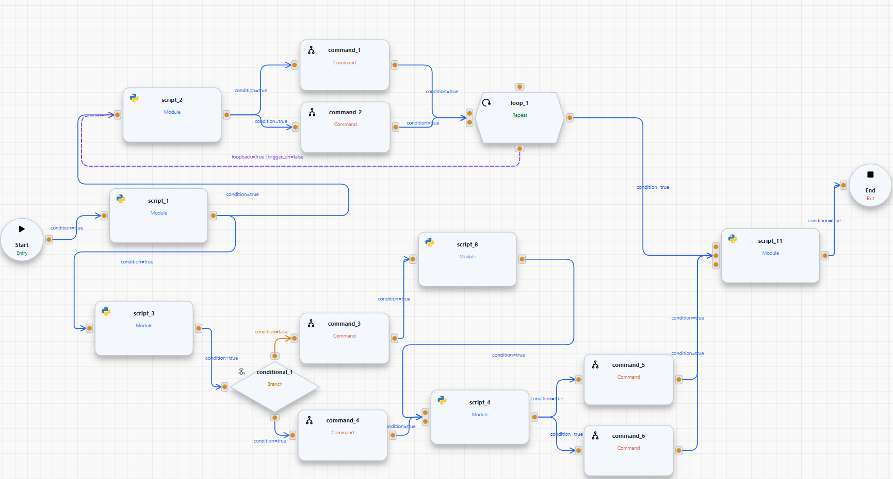

# Process workflow

A process is built as a workflow made of multiple modules.
The workflow controls how modules are executed, handling:

* parallel execution

* conditions (branching)

* loops (repetition)

This keeps control logic outside individual modules (sometimes called blocks), so each module stays focused on a single task.

## Module Types

There are four kinds of modules.

*  Script

A Script module contains the actual commands to run.
Use it to define the step-by-step actions of your protocol.

*  Loop

A Loop module repeats one or more modules.
Use it when a part of the protocol must run multiple times (for example: iterating over modules or repeating a some step).

*  Conditional

A Conditional module creates a branching point in the workflow.
Depending on the defined criteria, the process follows one branch or another.

*  Command

A Command module represents a single command sent to one associated device — no code required. Rather than
clicking New Module, you drag it directly onto the canvas from the
[Command List](build_protocols.md#command-list).

## Why use workflows?

Technically, you can implement loops and conditionals inside a single Script module using Python packages and native functions.
However, we recommend using the workflow approach because it makes protocols:

* easier to read and maintain

* more modular and reusable

* better structured (logic is explicit in the workflow)

## Example



In the example above, you can follow how the workflow is executed:

**1) Parallel execution (fan-out)**

After *script 1*, *2*, and *4*, the workflow splits into multiple branches.
This means the next connected modules can run in parallel (when they are independent).

**2) Loop execution**

The module *loop_1* repeats a part of the workflow.
In this example, it triggers the repeated execution of the branch that starts at *script 2*.

**3) Conditional execution (branching)**

The module *conditional_1* chooses one branch based on the condition criteria.
Here, it selects between the branch starting at *command 3* or *4*.

**4) Synchronization (wait / join)**

Some modules only start when all required input branches have finished.
For example, *script 11* waits until every incoming branch completes before it begins execution.

**5) Command modules**

The *command* blocks (*command_1* through *command_6*) are Command modules — each one sends a single command to
an associated device and was dragged directly onto the canvas from the [Command List](build_protocols.md#command-list),
rather than written as a Script.

## Building a module

To create a new Script, Loop, or Conditional module, use the matching action in the
[workflow canvas menu](build_protocols.md#workflow-canvas-menu) — **Add Script**, **Add Loop**, or **Add Conditional**.

### Saving

When you click Save, the script is stored automatically in the project directory using this structure:

```
...\ <project_folder> \ protocols \ <process_name>.py
```