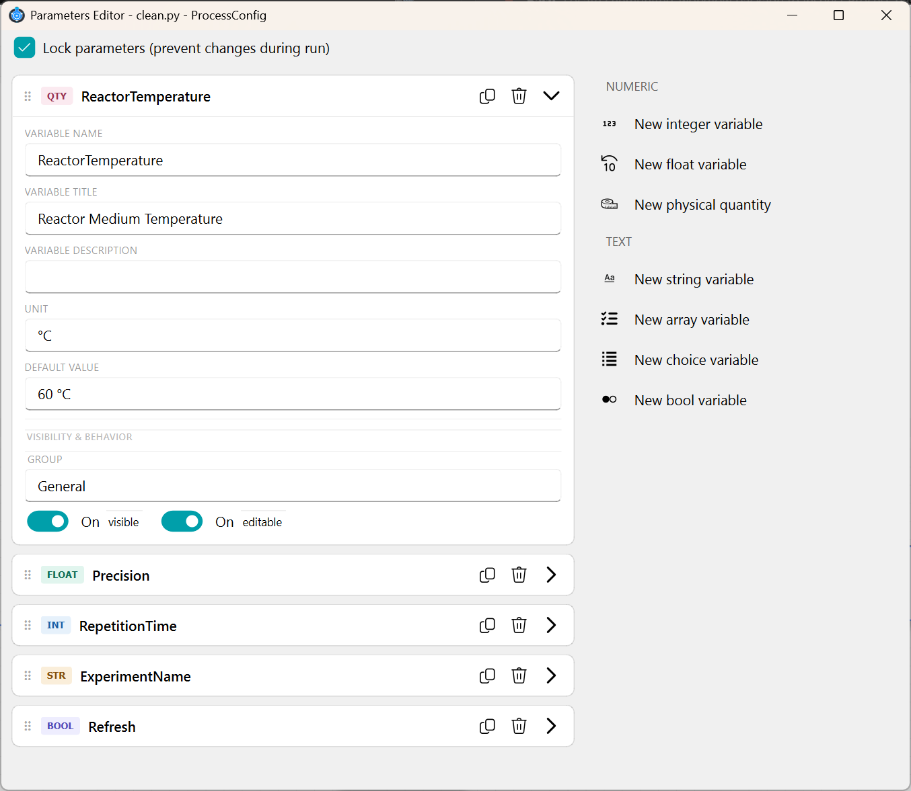
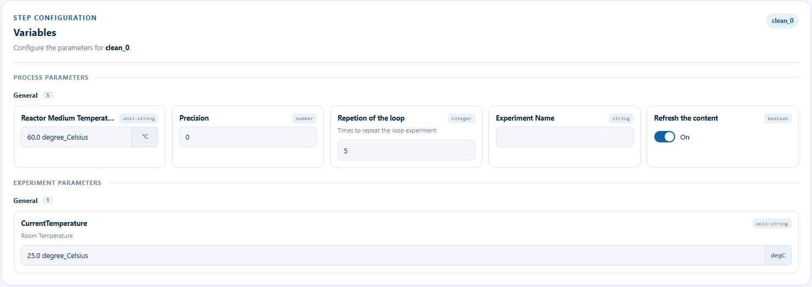

# Parameters

The Parameters Editor is a helper tool for creating variables (parameters) and making them available inside your
scripts. It opens on a specific process's `ProcessConfig` (for process parameters) or on the project's
`MainParameter` class (for main parameters, see [Script Editor](script_editor.md#inserting-a-parameter)).



The **Lock parameters** checkbox at the top controls whether the values can still be changed once the protocol is
running — it maps directly to `model_config = ConfigDict(frozen=True)` (locked) or `frozen=False` (editable at
runtime) on the generated class.

Below it, every existing parameter is listed as a collapsible row showing its type badge (e.g. `QTY`, `FLOAT`,
`INT`, `STR`, `BOOL`) and name, with actions to duplicate, delete, or expand it. On the right side, a panel lists
every parameter type that can be added, split into **Numeric** (integer, float, physical quantity) and **Text**
(string, array, choice, bool) — clicking one adds a new parameter of that type to the list.

## Creating a new parameter

Expanding a parameter row reveals its configuration fields:

* **Variable Name** — the Python identifier used to reference the parameter in scripts (e.g. `self.config.pump_vol`).
* **Variable Title** — the human-readable label shown to the user.
* **Variable Description** — optional help text shown alongside the field.
* **Unit** — only for physical-quantity parameters; the unit its value is expressed in (e.g. `°C`, `ml`).
* **Default Value** — the value used until the user overrides it.
* **Group** (under *Visibility & Behavior*) — which section the parameter is organized under in the generated
  form (for easier navigation among many parameters).
* **visible** / **editable** toggles (under *Visibility & Behavior*) — whether the parameter is shown to the user
  at all, and whether they're allowed to change it.

Numeric and text types also expose validation constraints for their type (e.g. `ge`/`le` bounds for integers and
floats, allowed length or pattern for strings, item count for arrays) — these prevent invalid inputs from being
entered downstream.

## Supported parameter types

The following parameter types are supported. 
When a parameter is created, a corresponding Field(...) definition is generated automatically.

1. Integer

```python
repetitions: int = Field(
        default=3,
        title="Repetitions",
        description="Number of experiment repeats.",
        ge=1,
        le=20,
        json_schema_extra={"group": "Process", "editable": True, "visible": True},
    )
```

2. Float

```python
precision: float = Field(
        default=0.8,
        title="Precision",
        description="Experiment precision.",
        ge=0,
        le=1,
        json_schema_extra={"group": "Process", "editable": True, "visible": True},
    )
```

3. String

```python
project_name: str = Field(
        default="Simulation",
        title="Project Name",
        description="A short identifier for this setup.",
        min_length=1,
        max_length=50,
        json_schema_extra={"group": "General", "editable": True, "visible": True},
    )
```

4. Array

```python
secondary_solvents: list[str] = Field(
        default=["Toluene", "DMF"],
        title="Secondary solvents",
        description="Optional co-solvents used during the reaction.",
        min_items=0,
        max_items=10,
        json_schema_extra={"group": "Solvents", "editable": True, "visible": True},
    )
```

5. Choice

```python
solvent: str = Field(
        default="DCM",
        title="Main solvent",
        description="Select the solvent used in the process.",
        json_schema_extra={
            "group": "Solvents",
            "editable": True,
            "visible": True,
            "Options": ["DCM", "Toluene", "Acetone", "DMF"],
        },
    )
```

6. Physical

```python
capacity: Annotated[
        ChemUnitQuantity,
        ChemQuantityValidator("ml"),
    ] = Field(
        default=ChemUnitQuantity("1 ml"),
        title="Component Capacity",
        description="Volumetric capacity of the component",
        json_schema_extra={
            "group": "Configuration",
            "editable": True,
            "visible": True,
            "unit": "ml",
        },
    )
```

7. Boolean

```python
active: bool = Field(
        default=True,
        title="Active experiment",
        description="Whether this configuration is currently active.",
        json_schema_extra={"group": "Configuration", "editable": True, "visible": True},
    )
```

## How parameters appear to the user

Once defined, each parameter is turned into an input field in the forms the rest of the platform generates for it —
grouped by the **Group** set above and labelled with its **Variable Title**.

**[Access Process Parameters](build_protocols.md#workflow-canvas-menu)** opens this generated form for the current
process's parameters, so their default values can be reviewed and edited without leaving the workflow canvas:


Before actually running a process, [Pre-Running](pre_running.md#options-in-the-processes-lists) shows the same
generated form again. This time for a specific queued instance (e.g. `clean_0`), with **Process Parameters** and
**Experiment Parameters** (the project's main parameters) both listed side by side so their final run values can be
set:


