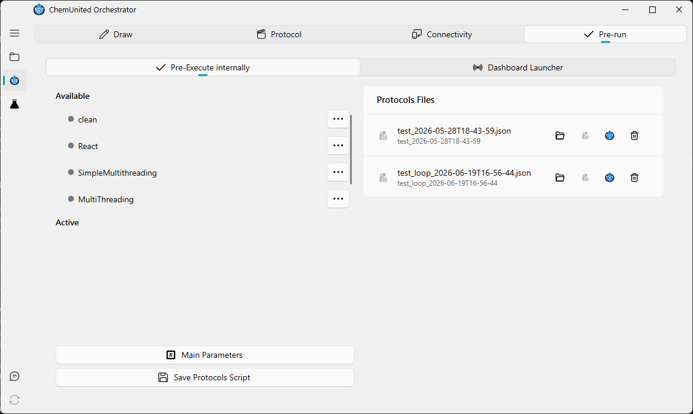
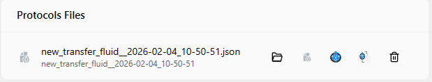

# Pre-Running

The Pre-Running step is responsible for building, saving, and launching the protocols to be executed.
A protocol is defined as a sequential list of processes that will be executed one after another.

This page covers the **Pre-Execute internally** tab. The Pre-Running frame also has a second tab,
[Dashboard Launcher](../dashboard/launcher.md), for starting and configuring the browser-based dashboard instead.

Below is the window corresponding to the Pre-Running step.

---

## Process Availability

The Pre-Running window contains two lists of processes:

1. **Processes Available**

These processes are defined and stored in the protocol but are **not currently scheduled for execution.**
This list is essentially a mirror of the processes defined in the **Protocols frame.**

2. **Processes Active**

These processes are enabled and will be executed in **monitoring** mode.

This separation allows the user to:

* Define multiple processes

* Choose which processes will be executed

* Define the execution order

* Repeat the same process multiple times if needed

In the example above:

* The Available list contains four independent processes

* The Active list contains three entries, where `process01` appears twice

The resulting execution sequence will be:
    
`process01` → `process02` → `process01`
    
This flexibility in arranging the Active list (and repeating individual processes) allows the user to customize
different execution scenarios according to their needs.

---

## **Options in the processes lists**

Each item in the list has a context menu, accessed via the **···** button, with the following options.

   **For items in the Available list:**

   -  **Activate**: Add this process to the Active list.

   **For items in the Active list:**

   -  **Process Parameters**: Access the process parameter window (see [Parameters](parameters.md#how-parameters-appear-to-the-user)).
   -  **Remove from Active**: Remove this process from the Active list.

  <strong>💡 Note</strong> 
  You can <strong>Activate</strong>
  the same process from the Available list as many times as you want, and each entry added to the Active list
  becomes its own independent instance (see below).

  <strong>💡 Note</strong> 
  When a process appears multiple times in the <em>Active</em> list, all instances share the same
  <strong>parameter definition</strong>, but each instance maintains its
  <strong>own independent parameter values</strong>.

    
  For example, if <code>process01</code> defines a parameter <code>x</code>:
  <ul>
    <li>The first <code>process01</code> in the Active list may run with <code>x = 1</code></li>
    <li>The second <code>process01</code> may run with <code>x = 3</code></li>
  </ul>

  Changing the parameter values of one process instance does <strong>not</strong> affect the others.
  This allows the same process to be reused multiple times within a protocol, each time with
  different runtime settings.

---

## Pre-Running Actions

On the bottom-left side of the Pre-Running window, three main action buttons are available:

*  **Main Parameters** 

Access and adjust the global parameters of the project for the current protocol.

*  **Run Monitoring** 

Launch the monitoring application to execute the protocol.
This requires that all electronic components are already connected and online in the **Connectivity** window.

*  **Save Protocol Script**  

Save the protocol — including all configured parameters — as a `protocol script file`.
The file is stored in JSON format and contains all information required to execute the protocol.

---

## Protocol Files

On the right side of the window, the **Protocol Files cards** are displayed.
All previously saved protocols appear here, allowing users to quickly inspect or relaunch them.

Each protocol card provides the following actions:

*  **Open local file**

Open the local folder containing the protocol script.

*  **Summary**

Open a read-only window displaying a summary of all predefined parameters.

*  **Run Monitoring** 

Execute the protocol directly in monitoring mode.

*  **Delete the protocol script**

Permanently remove the protocol file.
