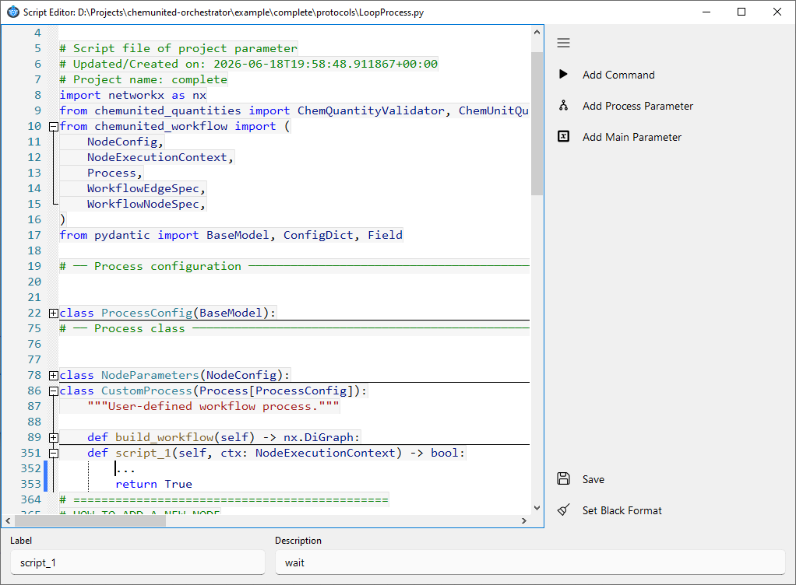

# Script Editor

The Script Editor is where you write and edit the Python code behind a **Script**, **Loop**, or **Conditional**
module (see [module types](module_workflows.md#module-types)). It also offers code-free helpers for inserting
commands and parameters, so you don't need to remember exact syntax or component names.

## Opening the script

Double-click the module (the block) you want to inspect on the workflow canvas. The Script Editor window opens
with the module's Python source on the left and a toolbar on the right:



| Icon | Action | Description |
|---|---|---|
|  | **Add Command** | Opens a dialog to build a device command and insert it as a new line of code. It relies on the same device/command information as the [Command List](build_protocols.md#command-list) you can drag onto the canvas, but here the result is a line of Python appended to the script instead of a standalone Command block. The new line is always added to the **end of the method currently open in the editor**. |
|  | **Add Process Parameter** | Inserts a reference to one of the current process's local parameters (see [Parameters](parameters.md)). |
|  | **Add Main Parameter** | Inserts a reference to one of the project's global parameters, shared across every process. |
|  | **Save** | Saves the script. |
|  | **Set Black Format** | Auto-formats the script using [Black](https://black.readthedocs.io/en/stable/index.html), Python's standard code formatter. |

## Inserting a parameter

**Add Process Parameter** and **Add Main Parameter** behave like the [Command List](build_protocols.md#command-list)
on the workflow canvas: clicking the button opens a list of the parameters available in that scope, and you drag
the one you want directly into the script. The reference is inserted at the **end of the method currently open in
the editor** — from there, cut and paste it wherever it's actually needed in the code.

* A **process parameter** named `pump_vol` is inserted as `self.config.pump_vol`.
* A **main parameter** named `pump_vol` is inserted as `self.main_parameters.pump_vol`.

## Generated code

Every module method receives `self` (the process instance) and `ctx: NodeExecutionContext` (the current node's
execution context), and returns a `bool`. Every time you build a command through **Add Command**, the editor
appends the corresponding Python call to the method currently open in the editor.

In the example below, the script sends a command to pump `"pump A"` to infuse 5 mL at 20 mL/min. After sending
the command, the platform automatically waits until the pump reports idle before continuing to the next line.

```python
...
def script_1(self, ctx: NodeExecutionContext) -> bool:
    self.platform["pump A"].put(  # Component name: pump A
        "infuse",       # Command name
        rate="20.0 milliliter / minute",  # Command parameter
        volume="5 milliliter",            # Command parameter
    )
    return True
```

If you want to use a predefined parameter from the process or main parameters instead of a literal value, insert
it with **Add Process Parameter** / **Add Main Parameter**, or paste the reference directly into the field.

In the example below, the process parameter `pump_vol` (defined on `ProcessConfig`, see [Parameters](parameters.md))
is used as the infusion volume instead of a literal value:

```python
...
def script_1(self, ctx: NodeExecutionContext) -> bool:
    self.platform["pump A"].put(  # Component name: pump A
        "infuse",       # Command name
        rate="20.0 milliliter / minute",  # Command parameter
        volume=self.config.pump_vol,      # Use predefined process parameter
    )
    return True
```

## Special blocks

Every module script returns a **boolean** (`True` or `False`), but only two [module types](module_workflows.md#module-types)
actually use that return value to drive the workflow's logic: **Loop** and **Conditional**.

* In a **Loop** module, the boolean decides whether the loop continues or stops.
* In a **Conditional** module, the boolean decides which branch is executed.

### 1) Loop module

A Loop module is typically used with an **iterator** to control how many times a section of the workflow should
repeat.

**How it works**

* The loop module runs.
* If the script returns `False`, the workflow repeats the loop (runs the loop branch again).
* If the script returns `True`, the workflow exits the loop and continues to the next module after the loop.

`ctx.iteration` is the loop's built-in counter: it is `0` on the first pass and is incremented automatically every
time the loop triggers a loopback, so you don't need to manage a counter parameter yourself.

Example: loop over an array of flow rates defined as a process parameter

```python
...
def loop_1(self, ctx: NodeExecutionContext) -> bool:
    if ctx.iteration >= len(self.config.FlowrateArray):
        ctx.runtime.status_message = "All flow rates completed."
        return True  # Exit loop

    ctx.runtime.status_message = f"Next flow rate: {self.config.FlowrateArray[ctx.iteration]}"
    return False  # Continue looping
```
<div class="info-block"> <strong>
💡 Information</strong><br> Because the loop decision is based on the function's return value (True/False), you
can build very flexible loops (e.g., looping until a sensor reaches a target, looping until a file exists, etc.),
not just fixed iteration counts.
</div>

### 2) Conditional module

A **Conditional** module chooses between two branches based on the boolean value returned by its script.

**How it works**

* If the script returns `True`, the workflow follows the **True branch**.
* If the script returns `False`, the workflow follows the **False branch**.

Example: simple conditional

```python
...
def conditional_1(self, ctx: NodeExecutionContext) -> bool:
    return True  # Follow the True branch
```