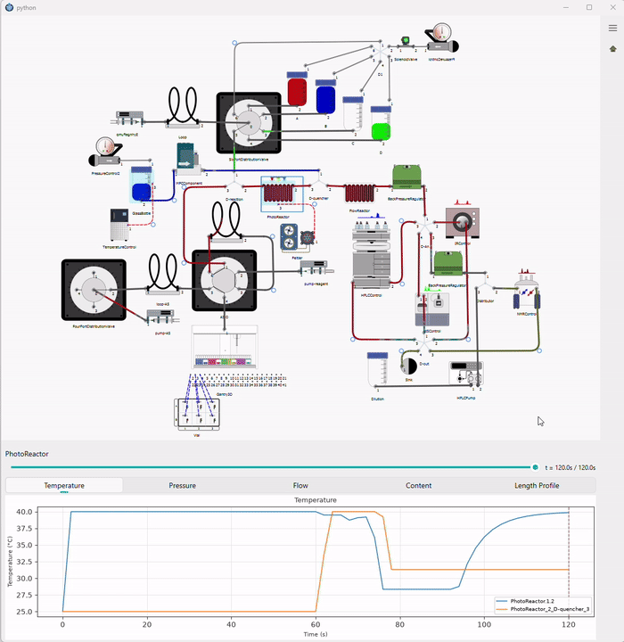
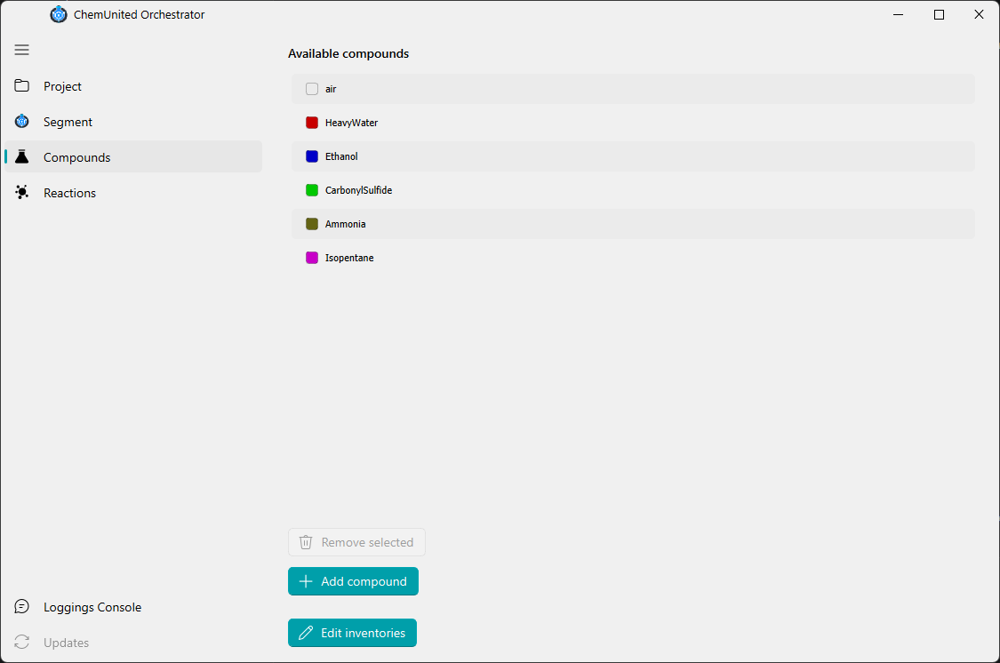
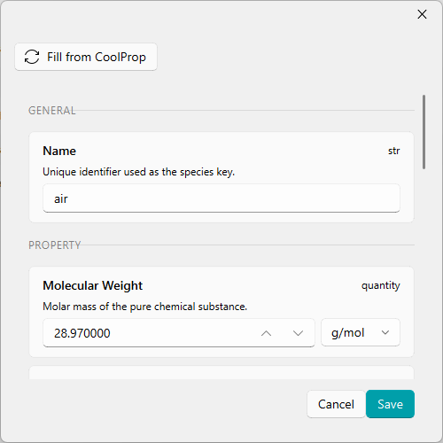
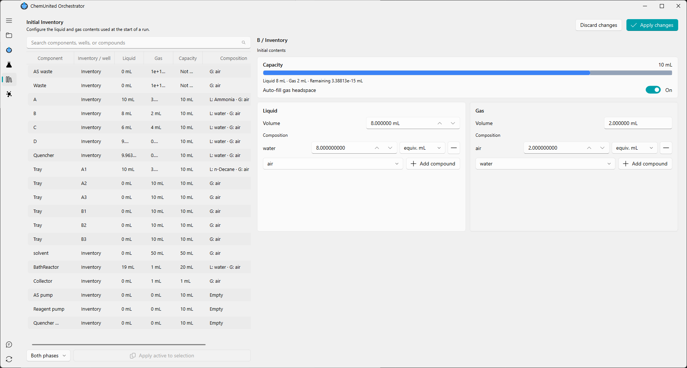
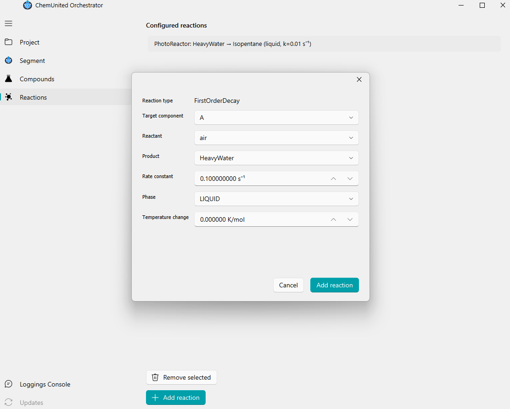

# Setup Digital Twins

A **digital twin** is a physics-based virtual copy of your platform. A protocol can run against it instead of
real hardware — useful for dry-testing logic, timing, and expected inventory changes before touching real
reagents.

## Launching a Simulation

From [Protocols](../protocols/build_protocols.md), open the process you want to test, right-click an empty area of its workflow canvas, and choose  **Simulate Process** from the context menu (see [Workflow canvas menu](../protocols/build_protocols.md#workflow-canvas-menu)). This starts a local simulation engine in the background automatically — you do not need to install or run anything separately — and opens the Simulation Report Window for that process.

## The Simulation Report Window

Running a simulation opens a live report window with its own copy of the platform — running or scrubbing a
simulation never touches your saved design, so it's safe to explore freely.

The top half is a graph view of the platform. Components flash briefly as commands are issued to them while the run progresses, and clicking a component or connection loads its data into the **Profiles** panel below, which has five tabs — **Temperature**, **Pressure**, **Flow**, **Content**, and **Length Profile** — plotting the selected item's values over the run.

Once a run has at least two recorded instants, a scrub slider appears above the tabs. Dragging it moves through
the recorded timeline, repainting the platform view (fill levels, valve positions, edge content) and the profile
plots' cursor to match.

<strong>💡 Not the same as the recorded dashboard</strong> 
This live window and the standalone HTML dashboard described under "Recorded Visualizations" below both read
the same recorded run, but they're two different views over it — the live window's five tabs are not the
recorded dashboard's Components/Edges/Overview/Signals/Pipe Cells tabs.

## Compounds & Initial Inventory

Before simulating, define the chemical species your platform uses on the **Compounds** page (left navigation,
next to Segment). Every species referenced anywhere on the platform — reagents, products, carrier fluids — must
be defined here first.

**Add compound** opens a dialog to name a new species and set its physical properties (molecular weight, heat capacities, liquid density, canvas color) by hand, or fetch them automatically with **Fill from CoolProp** instead of entering them manually:

Once a species is defined, use **Edit inventories** to set what's actually inside each vessel on your platform (flasks, bottles, reactors, syringe pumps, …) before the simulation starts. It opens a list of every component with internal storage; selecting one splits its contents into a **Liquid** and a **Gas** phase, each with its own volume and composition — add a compound to a phase and set its amount in moles, millimoles, molar concentration, or an equivalents volume, whichever is more convenient. A capacity bar flags a vessel as **over capacity** if liquid + gas together exceed its fixed volume, and an **Auto-fill gas headspace** toggle keeps the rest of the vessel topped up with air automatically as you adjust the liquid volume, so you don't have to balance the two by hand.

Edits are a draft: use **Apply changes** to commit them (or **Discard changes** to back out) before they become the starting state the simulation reads for every run, and remember to save the project afterwards to persist them to disk.

## Reactions

If a vessel's chemical content should change over the course of a run a reagent decaying, a product forming model that on the **Reactions** page (left navigation, next to Compounds). Only components with an internal inventory (vessels, flow reactors) can be a reaction target.

Each reaction converts a **reactant** into a **product**, at a given **rate constant**, within a specific **phase** (liquid or gas) of the target component's inventory — optionally releasing or absorbing heat via a **temperature change** per mole converted. The simulation applies these continuously as the run progresses; without a reaction defined, a vessel's contents stay chemically inert (only moved, mixed, or diluted, never converted).

## What Happens Under the Hood

The same `Process`/`Platform` code that runs against real hardware runs **unmodified** against the simulator, the simulation engine swaps in a stand-in client in place of each real HTTP device client, so no protocol code needs to know whether it's talking to a pump or a physics model.

<strong>💡 Terms at a glance</strong>  <strong>HydraulicGraph</strong> — the compiled network of nodes and edges built from your platform drawing, used to solve pressures and flows.  

<strong>Pocket</strong> — a discrete slug of fluid (a phase, volume, species, temperature) moving through the tubing.  <strong>Resistance override</strong> — how active components like pumps, valves, and back-pressure regulators actively drive the hydraulics, instead of passively obeying tubing geometry alone.

## Next steps

Once your protocol behaves as expected in simulation, connect real devices in [Connect Devices](../connectivity/connectivity.md), or see [The Dashboard](../dashboard/overview.md) to shadow a live run with Mode 2.
