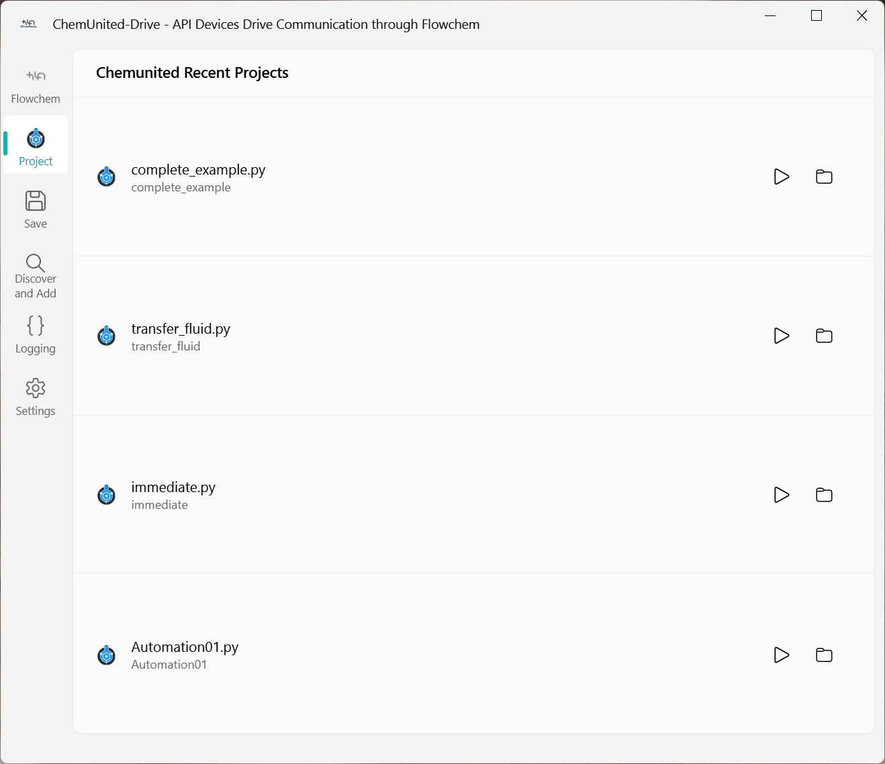
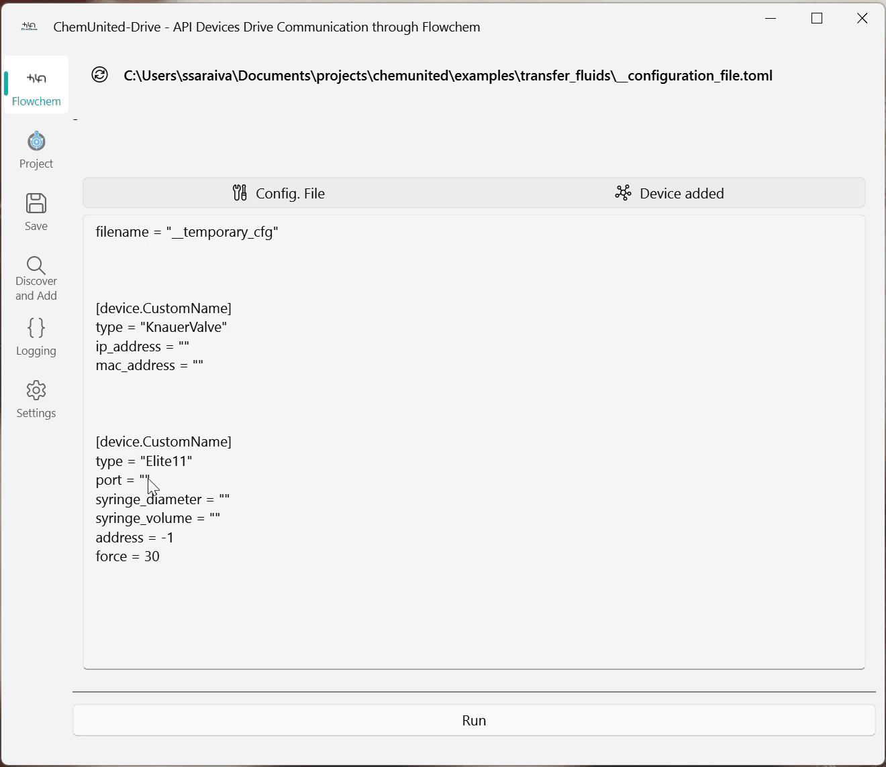
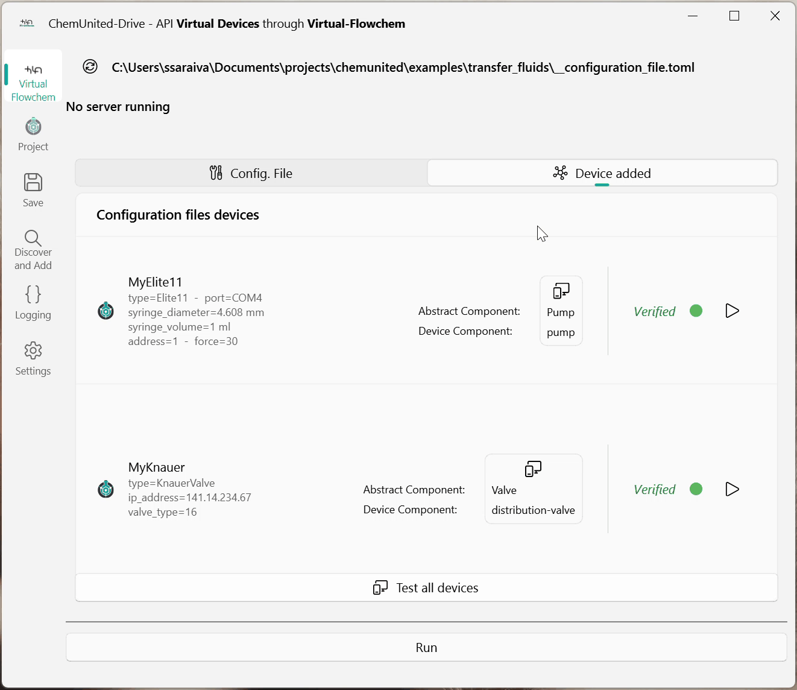

# Tutorial

<div class="warning-block">
<strong>⚠️ Outdated tutorial</strong><br>
This tutorial describes <strong>ChemUnited-Drive</strong>, a standalone helper tool that has since
been removed — there is no <code>chemunited-drive</code> command anymore. It is pending a rewrite
to reflect the current flow: run your own FlowChem server (see
<a href="../connectivity/connectivity.md">Setup Connectivity</a> and the
<a href="https://flowchem.readthedocs.io/en/latest/">FlowChem documentation</a>), then associate
it by drag-and-drop, or by hand-writing an <code>associations.json</code> entry for SiLA2/OPC UA
devices. The steps below no longer reflect the current product.
</div>

This tutorial demonstrates the main features of ChemUnited-Drive using a simple example configuration.
We will configure two devices from **HarvardApparatus** and **Knauer**:

* Elite11 syringe pump

* Distribution Valve

> **Goal:** Create a configuration file that launches a FlowChem server exposing these devices, validate connectivity, and start the server.

---

## Step 1 — Start ChemUnited-Drive

After creating a project in ChemUnited Orchestrator, open ChemUnited-Drive by running:

```bash
chemunited-drive
```

In the main window, select the project configuration workflow by clicking:
 -
`Open Project Configuration File`.

This option helps you create or edit the configuration file associated with your project.

<div class="info-block"> <strong>💡 Note</strong><br> You can use ChemUnited-Drive even without a 
ChemUnited Orchestrator project. The project integration is provided only for convenience
(it helps locate and manage configuration files).
</div>

---

## Step 2 — Add device blocks (discover or manual)

After opening the configuration editor, you can add devices in two ways:

* **Discover devices** (recommended when hardware is connected)

* **Add configuration blocks manually** (useful for Virtual Mode or when preparing the file in advance)

In this tutorial, we do not have real hardware connected, so we will add blocks manually:



---

## Step 3 — Configure device parameters

Once the device block is added, configure the connection and device parameters 
(e.g., address, port, serial settings, channel IDs, etc.).

If you are unsure what each parameter means, refer to FlowChem’s device documentation:
[Supported devices and configuration reference](https://flowchem.readthedocs.io/en/latest/user-guides/reference/devices/supported_devices.html).



At the end of this step, ChemUnited-Drive generates a **TOML configuration file**.

Example structure (illustrative):

```toml
[device.MyElite11]
type = "Elite11"
port = "COM4"
syringe_diameter = "4.608 mm"
syringe_volume = "1 ml"
address = 1
force = 30

[device.MyKnauer]
type = "KnauerValve"
ip_address = "141.14.234.67"
valve_type = "16"
```

---

## Step 4 — Run device diagnostics

Before launching the server, run Diagnostics to verify each device configuration independently.
This step is important because it helps you detect connection problems early (wrong address, missing device, incorrect parameters, etc.).

<div class="warning-block"> <strong>💡 Information</strong><br> In this tutorial we use <strong>Virtual Mode</strong> 
for demonstration, since no real devices are connected. Enable it in <code>Settings → Virtual Mode</code>. 
</div> 


---

## Step 5 — Launch the FlowChem server

Once diagnostics succeed, launch the server.
ChemUnited-Drive will start the FlowChem service and expose the configured devices through an API.

You can then:

open the server link directly (if provided), or

inspect the logs to confirm the server is running and devices were loaded correctly.



---

## What you can do next

After the server is running, return to ChemUnited Orchestrator and associate the online devices with the 
abstract components in your workflow graph (drag-and-drop association). Once connected, your protocol can 
send commands to the devices via API.
