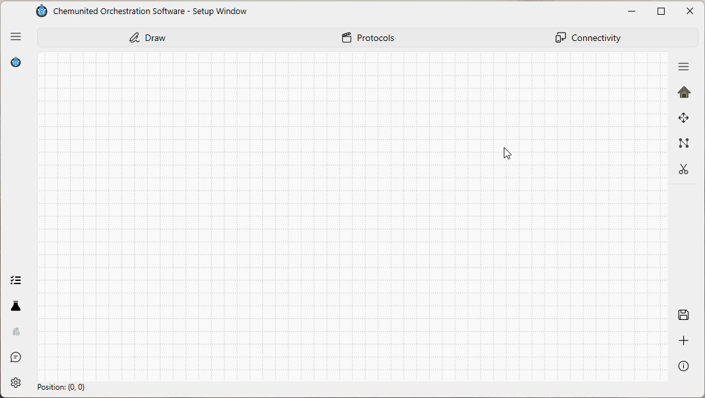
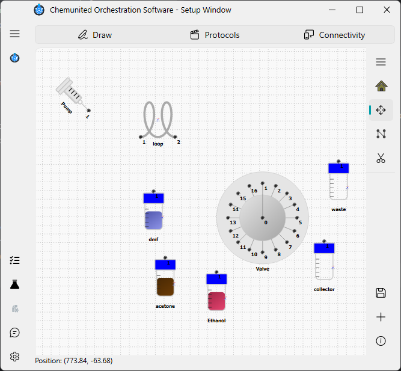

# Tutorial Example

This tutorial guides you through building a very simple setup, step by step, so you can learn how ChemUnited
works in practice. The goal is to build the simple setup shown below:

This setup is responsible for transferring a defined volume of fluid from one vessel to another. Follow the
step-by-step demonstration shown below.

## 1 — Insert all components

To add a component to the drawing:

a - Select it from the desired category,

b - Click Add,

c - Then click on the canvas where you want to place it.

Begin by inserting all the components exactly as shown in the illustration:

The components required for this setup are:

* **1 x Syringe Pump** - from `pump` group

* **1 x Sixteen Port Distribution Valve** - from `valve` group

* **1 x Loop** - from `glasses` group

* **5 x Glass Bottle** - from `glasses` group

  

 
<strong>💡 Information</strong>  
To set an inclination for the pump, simply double-click the component to open the properties window. 
Then, adjust the angle to <strong>45°</strong>.

## 2 - Build connections

A connection is created by linking two compatible connection points.
When building a connection, the user may add several inflection points to better route the connection through the setup layout.
Connections can also be reshaped—made more curved or more linear—to improve the clarity and aesthetics of the design.

