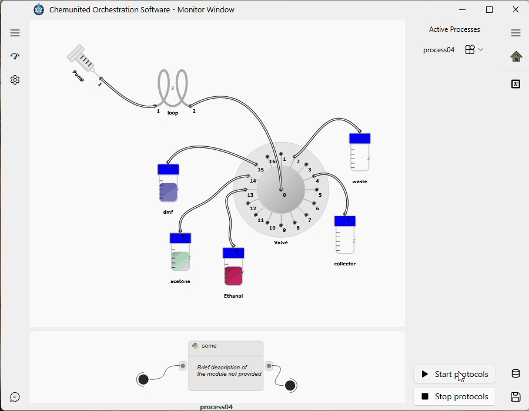

# Run a Protocol

This tutorial continues from [Build a Protocol](protocols_tutorial.md): with a process already built and its
active processes selected in [Pre-Running](../protocols/pre_running.md), you're ready to run it from the
[Execution window](../monitoring/run_monitoring.md).

***

## Step 1 — Execute the protocol

Open the **Protocols** page of the Execution window and click **Execute**. The application runs the processes
listed under **Active Processes** in order.

***

## Next steps

Once a protocol starts, execution is actually handed off to a separate execution engine (the "work-server") that
also exposes a browser dashboard and a remote/automation API — see [The Dashboard](../dashboard/overview.md) to
control or inspect the same run from a browser or another machine.
