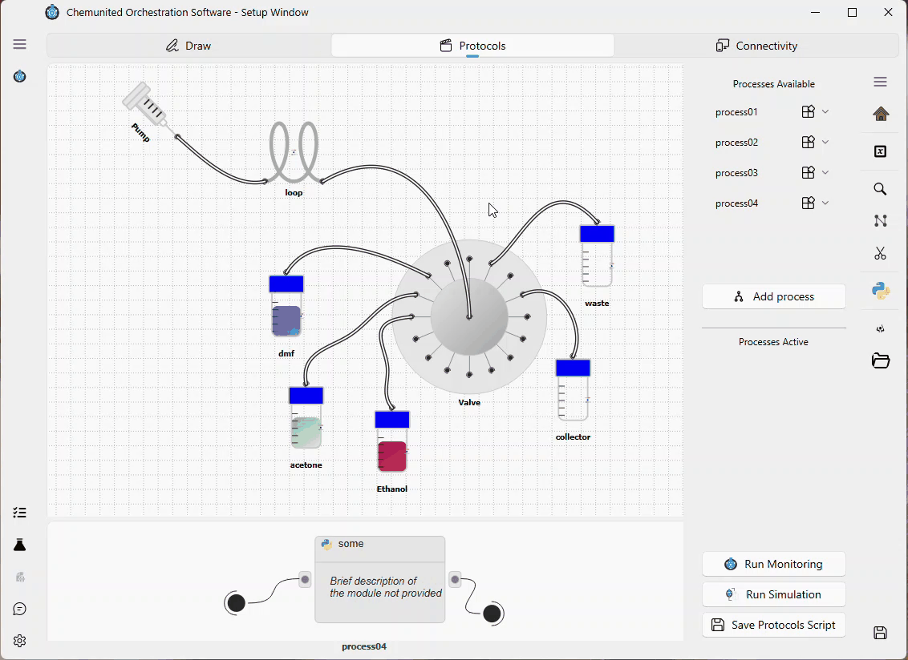
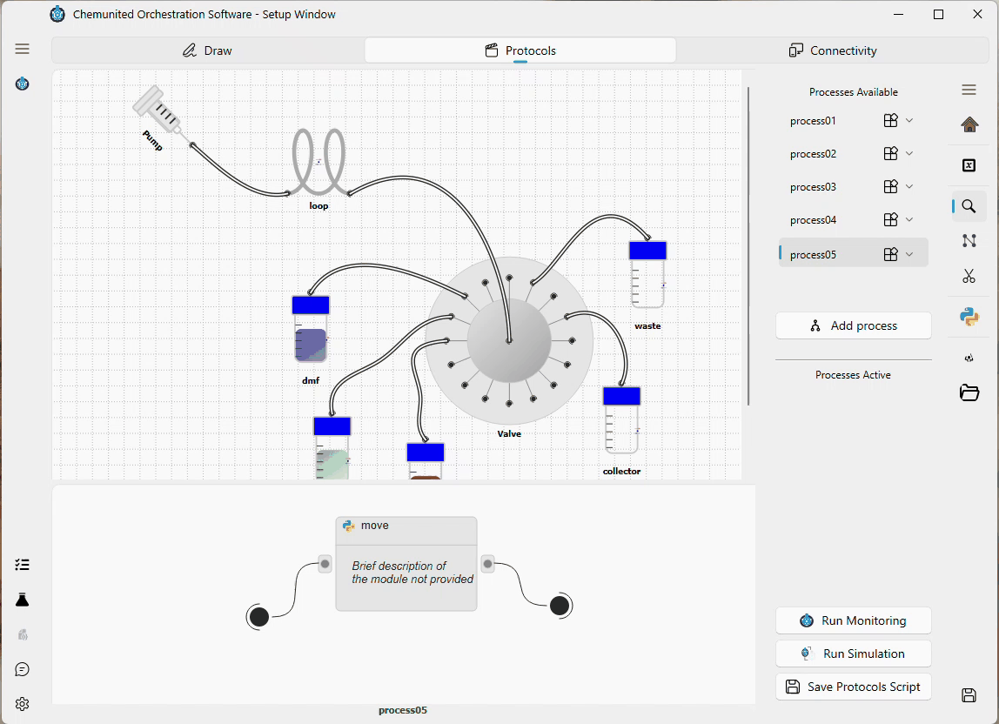
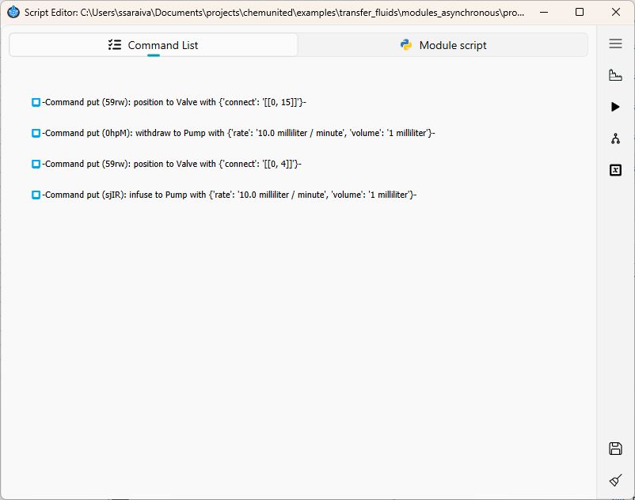

# Tutorial Example

In this tutorial, you will build a simple protocol with a single module. 
The module will transfer a defined volume of liquid from a source vessel to a collector.

In our example, we will move liquid from **DMF** to the **Collector** using a valve and a syringe pump.

***

## Step 1 — Create a new process

Create a new process and name it `process 05`.



***

## Step 2 — Add a module to the workflow

Add a new module called move to the `process 05` workflow.
Then connect the **Start** and **End** nodes to this module.


***

## Step 3 — Open the module script

Enable **Inspect Module** mode and click the **move** module to open its script editor.



***

## Step 4 — Implement the transfer procedure

We will transfer 1 mL at a flow rate of 10 mL/min from the DMF vessel to the Collector.

This transfer is implemented using four commands:

1. Switch the valve to position 15 (connects the DMF vessel).

2. Withdraw 1 mL using the syringe pump Pump.

3. Switch the valve to position 4 (connects the Collector vessel).

4. Infuse 1 mL using the syringe pump Pump.

<div class="info-block"> <strong>💡 Information</strong><br> 
This example does not account for dead volume between the vessels and the valve.
It is intended for demonstration purposes only. </div>


***

## Final script

Your module script should contain the four commands below:

```python
...
def script(
    platform: "PersonalOrchestrator",
    process_parameters: "ProcessParameters",
    parameters: "MainParameters",
):
    ...

    platform["Valve"].put("position", connect="[[0, 15]]")
    platform["Pump"].put(
        "withdraw", rate="10.0 milliliter / minute", volume="1 milliliter"
    )
    platform["Valve"].put("position", connect="[[0, 4]]")
    platform["Pump"].put(
        "infuse", rate="10.0 milliliter / minute", volume="1 milliliter"
    )
```

Also, you can inspect the command list in the script window.



***

## Next steps

Your protocol is now ready to run in **Simulation** or **Monitoring** mode.
Continue with the next tutorials for detailed instructions:
* [simulation](../simulation/digital_twins.md)
* [Run a Protocol](monitoring_tutorial.md)
