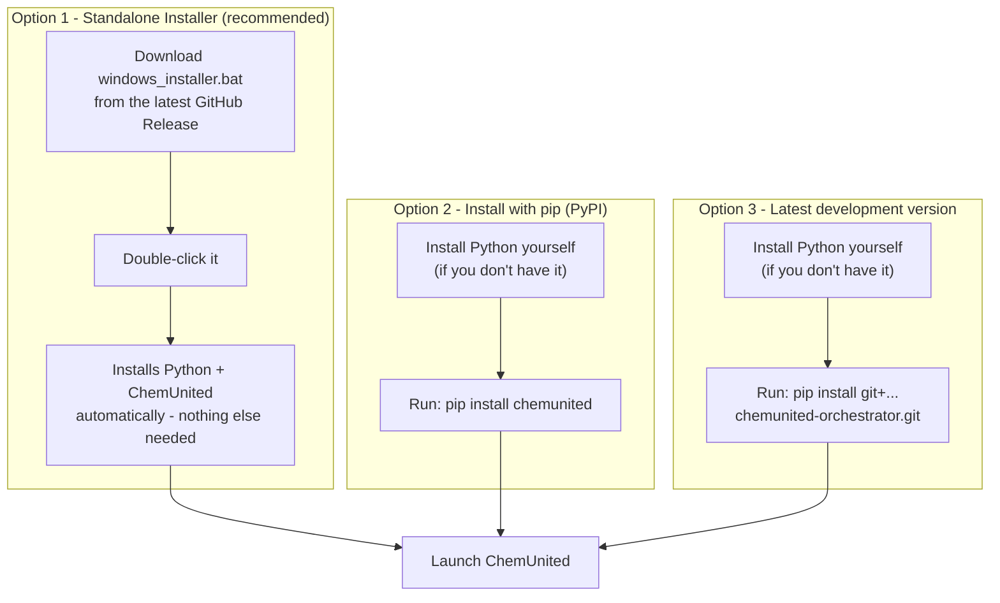

# Install ChemUnited

ChemUnited is available on PyPI as the `chemunited` package, and its source is hosted on GitHub.
The `chemunited` app itself runs on Windows, macOS, and Linux — only the one-click standalone
installer (Option 1 below) and its auto-generated Desktop shortcut are Windows-specific
conveniences.

You don't need to be a programmer to install ChemUnited. If you're on Windows and have never used
a terminal or installed Python before, start with **Option 1** below — it handles everything for
you. On macOS or Linux, use **Option 2**.

## Choose how to install

There are three ways to get ChemUnited onto your computer. They all end up in the same place —
a working `chemunited` command you can launch — but they differ in how much you need to already
have installed.



- **Option 1 — Standalone Installer**: the easiest path, and the one we recommend for most
  people. One file, one double-click, nothing to install by hand first. **Windows only.**
- **Option 2 — pip install from PyPI**: works on Windows, macOS, and Linux. For readers already
  comfortable with Python and a terminal, or who want ChemUnited inside a specific Python
  environment they manage themselves — and the only option if you're not on Windows.
- **Option 3 — Install from GitHub**: for readers who want the newest, not-yet-released changes.

## Option 1 — Standalone Installer (recommended)

<div class="warning-block">
  <strong>⚠️ Windows only</strong><br>
  This installer only works on Windows. If you're on macOS or Linux, this option isn't available —
  see the note at the top of this page.
</div>

This is a single file that sets up everything for you: Python, ChemUnited, and a Desktop shortcut
— with no admin rights required.

1. Go to the [latest release](https://github.com/automatedchemistry/chemunited-orchestrator/releases/latest)
   page on GitHub and download `windows_installer.bat`.
2. Double-click the downloaded file to run it. A black console window will open — this is
   expected, just let it run.
3. The installer will:
   - Set up its own private copy of Python (you don't need Python installed beforehand).
   - Install ChemUnited into a dedicated folder in your user profile.
   - Add a **ChemUnited** shortcut to your Desktop.
4. When it prints `Done!`, close the window and double-click the new **ChemUnited** shortcut on
   your Desktop to launch the app.

<div class="info-block">
  <strong>💡 Tip</strong><br>
  You can re-run <code>windows_installer.bat</code> at any time (for example, after downloading a
  newer release) to upgrade your installation to the latest version.
</div>

Once you've installed this way, you can skip straight to [Updating ChemUnited](#updating-chemunited)
further down whenever you want to upgrade — the rest of this page (pip, virtual environments, the
desktop shortcut menu) is for the other two install methods.

## Option 2 — Install with pip (PyPI)

This method is for readers who already work with Python, or who want more control over which
Python environment ChemUnited is installed into.

### Installing Python

If you already have Python, skip to [Install ChemUnited with pip](#install-chemunited-with-pip)
below.

1. Go to [python.org/downloads](https://www.python.org/downloads/) and download the installer for
   your operating system. As an example of a specific version page, see
   [Python 3.14.7](https://www.python.org/downloads/release/python-3147/).
2. Run the installer. **On Windows, make sure to check the box labeled "Add python.exe to PATH"**
   at the bottom of the first install screen — this is the most common step people miss, and
   without it, typing `python` or `pip` in a terminal won't work.
3. Once installed, open a terminal (on Windows: **Command Prompt** or **PowerShell**, found via
   the Start menu) and check it worked by typing:

   ```shell
   python --version
   ```

   You should see something like `Python 3.14.7` printed back.

### Using a virtual environment (`.venv`)

<div class="info-block">
  <strong>💡 Tip</strong><br>
  We recommend installing ChemUnited inside a virtual environment (venv/conda) to avoid
  conflicts with other Python packages.
</div>

A virtual environment is a self-contained folder that keeps ChemUnited's dependencies separate
from anything else installed on your computer, so it can't interfere with — or be interfered with
by — other Python projects. To create and use one:

1. Open a terminal in the folder where you'd like the environment to live, and create it:

   ```shell
   python -m venv .venv
   ```

2. Activate it — this must be done every time you open a new terminal to use ChemUnited:

   ```shell
   # Windows (Command Prompt or PowerShell)
   .venv\Scripts\activate

   # macOS / Linux
   source .venv/bin/activate
   ```

   Your terminal prompt should now start with `(.venv)`, showing the environment is active.

### Install ChemUnited with pip

With Python (and optionally your `.venv`) ready, install ChemUnited:

```shell
pip install chemunited
```

## Option 3 — Install the latest development version (GitHub)

If you want the most recent changes that may not yet be published on PyPI, install directly from
GitHub instead. This also requires Python — see
[Installing Python](#installing-python) above if you need it.

```shell
pip install git+https://github.com/automatedchemistry/chemunited-orchestrator.git
```

## Updating ChemUnited

ChemUnited is under active development (e.g., new components and features are added over time).

- If you installed with **Option 1**, re-run `windows_installer.bat` (downloaded again from the
  [latest release](https://github.com/automatedchemistry/chemunited-orchestrator/releases/latest)
  if you don't still have it) to upgrade.
- If you installed with **Option 2 or 3** (pip), activate the same environment you installed into,
  if any, and run:

  ```shell
  pip install chemunited --upgrade
  ```

## Create a Desktop Shortcut (Windows)

<div class="warning-block">
  <strong>⚠️ Windows only</strong><br>
  This feature is Windows-only — the menu item described below is hidden on other platforms.
</div>

<div class="info-block">
  <strong>💡 Note</strong><br>
  If you installed ChemUnited with the standalone installer (Option 1), this was already done for
  you — you don't need to do it again. This section is for readers who installed with pip
  (Options 2 or 3) and want a shortcut without activating their environment and typing a command
  every time.
</div>

1. Launch ChemUnited as usual (`chemunited`, or `python -m chemunited`).
2. Open the **Project** menu and click **Create Desktop Shortcut...**.
3. Pick a destination folder in the dialog that appears — your Desktop, the Start Menu, or any
   other folder. The dialog opens on your Desktop by default.

This creates two files:

- A `chemunited.bat` launcher next to your ChemUnited installation, which starts the app with
  `pythonw.exe` (no console window) from the Python environment you're currently running in.
- A shortcut (`ChemUnited.lnk`) at the folder you picked, pointing at that launcher and using the
  ChemUnited application icon.

<div class="info-block">
  <strong>💡 Tip</strong><br>
  If a shortcut already exists at the chosen location, ChemUnited asks before replacing it. If you
  reinstall ChemUnited into a different virtual environment, regenerate the shortcut so it points
  at the new environment.
</div>
