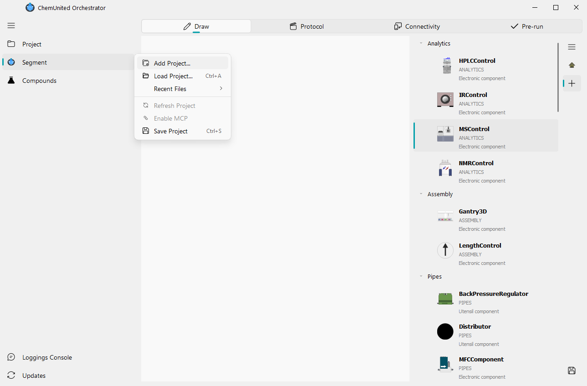

# Build a new project

This section walks you through the steps to create a new project in ChemUnited.
By the end, you’ll know how to start the Designer, create a project folder, and understand how
ChemUnited keeps track of your recent work.

## Launch the Designer

After installing ChemUnited, open the Designer by running:

```bash
chemunited
```

This opens the **Recent Projects** window:

<p align="center">

</p>

## Create a new project

Click **New**. ChemUnited will ask you to:

1. enter a **project name**, and

2. select a **directory** where the project files will be stored.

## Recent projects list

Whenever you create or open a project, ChemUnited records its directory path in a small local file,
`recent_projects.json`, managed via [platformdirs](https://pypi.org/project/platformdirs/) in the OS-appropriate
application-data directory (not inside the project itself). Up to the 10 most recently opened projects are kept,
and entries pointing at directories that no longer exist are pruned automatically. This is why your previously
opened projects appear in the **Recent Projects** list when you start ChemUnited — so you can quickly resume work
without browsing for the folder again.

<div class="info-block">
  <strong>💡 Tip</strong><br>
  ChemUnited projects are lightweight: they are mainly composed of Python scripts and JSON files.
For better traceability and reproducibility, we strongly recommend using version control (for example, Git) to track changes over time.

This is especially useful when you:

* update workflows and scripts frequently,

* collaborate with others,

* want to roll back to a previous working version,

* need a clear history for experiments and protocol development.
</div>

## The Project Folder

Creating a new project generates a plain directory on disk — this directory *is* the project; nothing is hidden
away in a database. It looks like this:

```text
my_project/
├── manifest.json                # project identity: name, version, description, process order
├── pyproject.toml                # makes the project directory pip-installable
├── main.py                       # entry point for running the configured protocol outside the GUI
├── draw/
│   ├── setup.py                  # your platform drawing, as generated Python code
│   └── platform.svg              # an always-up-to-date image export of the platform
├── protocols/
│   ├── __init__.py                # auto-generated — do not edit by hand
│   ├── main_parameters.py         # parameters shared by every process
│   └── <process_name>.py          # one file per process you create
├── protocols_historic/
│   └── <process>_<timestamp>.json # saved protocol script snapshots (from Pre-Running)
├── connectivity/
│   └── associations.json          # device connections — machine-specific
├── log/                           # execution logs (local only, never shared)
└── .git/                          # full version history, initialized automatically
```

You do not need to create or edit most of these files by hand — the GUI writes and updates them as you draw,
build protocols, and run. A full technical breakdown of each file is in
[Software design](../developer/software_design.md).

<div class="info-block">
  <strong>💡 Note</strong><br>
  A project is automatically initialized as a Git repository, and ChemUnited creates a commit every time you save
  (platform layout, a process, main parameters). This is the version history mentioned in the tip above — you get
  it for free without doing anything extra.
</div>

## The `.chemunited` File

A `.chemunited` file is a **ZIP export** of your project folder — a portable snapshot you can send to a
colleague, back up, or archive, without needing them to have Git or the exact same folder layout.

* `.git/`, `.gitignore`, and the local `log/` folder are **excluded** from the export — history and local run logs
  don't travel with it.
* Opening a `.chemunited` file unpacks it next to the archive (into a folder named after the project) and
  initializes a fresh Git history there — the archive itself carries no version history.
* The working directory is always the source of truth; `.chemunited` is only ever a snapshot used for sharing or
  archiving, never something you work out of directly.

## Next steps

Ready to try it yourself? The [Tutorial](../tutorials/drawing_tutorial.md) section walks through building a
simple setup from scratch.